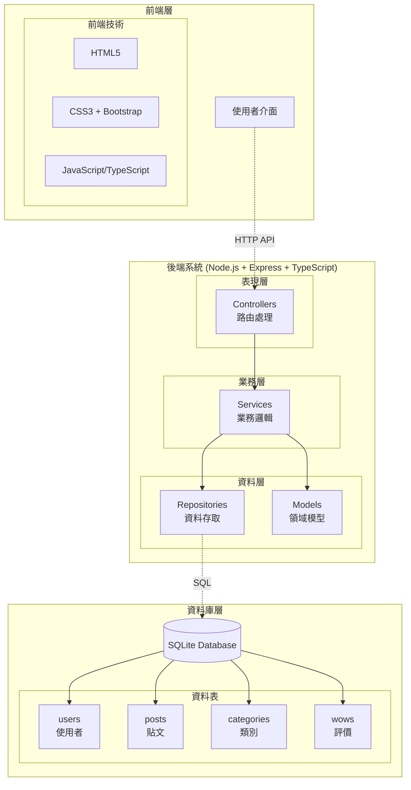

# Aotter-Wow 評價網站 - OOAD 總結報告

## 🎯 專案概述

**專案名稱**: Aotter-Wow 評價網站  
**建立日期**: 2025年6月22日  
**開發方法**: 物件導向分析與設計 (OOAD)  

## 📋 已完成的 OOAD 階段

### ✅ 1. 需求分析階段 (Requirements Analysis)
**文件**: `docs/requirements.md`

**主要成果**:
- 12 個功能需求 (FR-001 到 FR-012)
- 7 個非功能需求 (NFR-001 到 NFR-007)  
- 8 個業務規則 (BR-001 到 BR-008)
- 8 個使用者故事
- 明確的系統邊界定義

**核心功能確認**:
- 使用者註冊/登入系統
- 文字貼文發布功能
- Wow 評價系統（類似按讚）
- 多類別支援（包含動物類別）
- Wow 排行榜功能
- 基本管理功能

---

### ✅ 2. 分析階段 (Analysis)  
**文件**: `docs/use-cases.md`

**主要成果**:
- 識別 3 種主要參與者：一般使用者、管理員、訪客
- 定義 15 個使用案例 (UC-001 到 UC-015)
- 詳細描述 5 個核心使用案例的流程
- 明確使用案例間的關係（包含、擴展）

**核心使用案例**:
- UC-001: 使用者註冊
- UC-005: 發布貼文  
- UC-009: 給予 Wow 評價
- UC-012: 查看 Wow 排行榜
- UC-014: 管理不當內容

---

### ✅ 3. 領域建模階段 (Domain Modeling)
**文件**: `docs/domain-model.md`

**主要成果**:
- 識別 4 個核心實體：User, Post, Category, Wow
- 定義 3 個值物件：UserProfile, PostContent, WowStats
- 建立完整的概念類別圖
- 識別 4 個領域服務和 3 個聚合根
- 定義 3 個重要領域事件

**核心關係**:
- User ----< Post (一對多)
- Post >---- Category (多對一)  
- User ----< Wow >---- Post (多對多透過 Wow)

---

### ✅ 4. 系統架構設計階段 (Architecture Design)
**文件**: `docs/architecture.md`, `docs/sequence-diagram.md`, `docs/class-diagram.md`

**主要成果**:
- 採用分層架構 + MVC 模式
- 完整的技術選型（Node.js + TypeScript + SQLite）
- 4 層架構設計：表現層、服務層、資料存取層、資料庫層
- 詳細的目錄結構規劃
- RESTful API 端點設計
- 完整的資料庫設計（4 個資料表 + 索引）
- **7個核心順序圖**：使用者註冊、登入、發文、Wow評價、排行榜、搜尋、管理
- **完整類別圖設計**：涵蓋所有層級的類別定義、介面、DTO、工具類別
- **設計模式應用**：Repository、Service Layer、DTO、Factory、Strategy 模式
- **SOLID 原則體現**：職責分離、開放封閉、依賴倒置等
- 安全性和效能考量

## 🏗️ 系統架構概覽

## 📊 關鍵設計決策

### 技術決策
1. **資料庫**: 選擇 SQLite - 適合 Demo，輕量級，無需額外安裝
2. **後端**: Node.js + TypeScript - 型別安全，開發效率高
3. **前端**: 傳統 MVC - 簡單直接，適合小型專案
4. **認證**: Session-based - 比 JWT 簡單，適合 Demo

### 業務規則決策
1. **Wow 唯一性**: 每個使用者對同一貼文只能給一次 Wow
2. **自評限制**: 使用者不能對自己的貼文給 Wow
3. **內容導向**: 強調正面內容，建立良好社群氛圍
4. **簡化權限**: 只有兩種使用者類型（一般使用者、管理員）

## 🚀 接下來的步驟

### 第一階段：基礎實作
1. **專案初始化**
   - 建立 Node.js 專案
   - 安裝必要套件
   - 設定 TypeScript 和 ESLint

2. **資料庫設定**
   - 建立 SQLite 資料庫
   - 執行資料表建立腳本
   - 準備測試資料

3. **核心功能實作**
   - 使用者註冊/登入
   - 貼文 CRUD 功能
   - Wow 評價系統

### 第二階段：功能完善
1. **進階功能**
   - 搜尋功能
   - 排行榜功能
   - 管理功能

2. **使用者介面**
   - 響應式設計
   - 互動效果
   - 使用者體驗優化

### 第三階段：測試與部署
1. **測試**
   - 單元測試
   - 整合測試
   - 使用者接受測試

2. **部署**
   - 本地 Demo 環境
   - 可選：雲端部署

## 💡 後續問題確認

在開始實作之前，我需要確認幾個細節：

### 🎨 UI/UX 偏好
1. 您希望的 UI 風格？（簡潔、現代、溫暖、專業？）
2. 色彩主題偏好？
3. 是否需要特別的動物主題元素？

### 🔧 功能細節
1. 貼文內容長度限制？
2. 需要哪些預設類別？（動物、美食、旅遊...）
3. 管理員後台需要哪些統計資訊？

### 📱 技術偏好  
1. 是否希望使用 Vue.js 讓前端更現代化？
2. 是否需要即時更新功能（WebSocket）？
3. 是否需要匯出資料功能？

請告訴我您希望先從哪個部分開始實作，我會立即著手建立專案並開始編程！
