# Aotter-Wow 評價網站 - 類別圖設計

## 1. 類別圖概述

類別圖展示了系統中各個類別的結構、屬性、方法以及它們之間的關係。本設計遵循分層架構原則，將類別分為領域模型、服務層、資料存取層和控制層。

## 2. 領域模型類別圖

### 2.1 核心實體類別

### 2.2 值物件類別

## 3. 服務層類別圖

### 3.1 業務服務類別

```mermaid
classDiagram
    class UserService {
        -userRepository: UserRepository
        +constructor(userRepository: UserRepository)
        +registerUser(userData: RegisterRequest): Promise~User~
        +authenticateUser(username: string, password: string): Promise~User~
        +getUserProfile(userId: number): Promise~UserProfile~
        +updateUserProfile(userId: number, profile: UserProfile): Promise~void~
        +getUserStats(userId: number): Promise~UserStats~
        -hashPassword(password: string): string
        -validateUserData(userData: RegisterRequest): void
    }

    class PostService {
        -postRepository: PostRepository
        -categoryRepository: CategoryRepository
        +constructor(postRepo: PostRepository, categoryRepo: CategoryRepository)
        +createPost(postData: CreatePostRequest, authorId: number): Promise~Post~
        +getPost(postId: number): Promise~Post~
        +getAllPosts(pagination: Pagination): Promise~Post[]~
        +getPostsByCategory(categoryId: number): Promise~Post[]~
        +getTopWowPosts(limit: number): Promise~Post[]~
        +updatePost(postId: number, updateData: UpdatePostRequest): Promise~void~
        +deletePost(postId: number, userId: number): Promise~void~
        +searchPosts(keyword: string, filters: SearchFilters): Promise~Post[]~
        -validatePostData(postData: CreatePostRequest): void
    }

    class WowService {
        -wowRepository: WowRepository
        -postRepository: PostRepository
        +constructor(wowRepo: WowRepository, postRepo: PostRepository)
        +giveWow(userId: number, postId: number): Promise~Wow~
        +getWowsByPost(postId: number): Promise~Wow[]~
        +getWowsByUser(userId: number): Promise~Wow[]~
        +hasUserWowedPost(userId: number, postId: number): Promise~boolean~
        +getWowStats(postId: number): Promise~WowStats~
        -validateWowRules(userId: number, postId: number): Promise~void~
        -checkDuplicateWow(userId: number, postId: number): Promise~boolean~
        -checkSelfWow(userId: number, postId: number): Promise~boolean~
    }

    class CategoryService {
        -categoryRepository: CategoryRepository
        +constructor(categoryRepository: CategoryRepository)
        +getAllCategories(): Promise~Category[]~
        +getCategory(categoryId: number): Promise~Category~
        +createCategory(categoryData: CreateCategoryRequest): Promise~Category~
        +getCategoryStats(categoryId: number): Promise~CategoryStats~
        -validateCategoryData(categoryData: CreateCategoryRequest): void
    }
```

### 3.2 請求/回應 DTO 類別

## 4. 資料存取層類別圖

### 4.1 Repository 介面

### 4.2 Repository 實作類別

## 5. 控制層類別圖

### 5.1 控制器類別

## 6. 中介軟體類別圖

## 7. 資料庫連接類別圖

## 8. 工具類別圖

```mermaid
classDiagram
    class PasswordHelper {
        +static hash(password: string): Promise~string~
        +static verify(password: string, hash: string): Promise~boolean~
        +static generateSalt(): string
        -static validatePassword(password: string): boolean
    }

    class ValidationHelper {
        +static validateEmail(email: string): boolean
        +static validateUsername(username: string): boolean
        +static validatePassword(password: string): boolean
        +static sanitizeInput(input: string): string
        +static escapeHtml(html: string): string
    }

    class DateHelper {
        +static formatDate(date: Date): string
        +static parseDate(dateString: string): Date
        +static isValidDate(date: any): boolean
        +static getRelativeTime(date: Date): string
    }

    class ResponseHelper {
        +static success~T~(data: T, message?: string): ApiResponse~T~
        +static error(message: string, details?: any): ApiResponse~null~
        +static paginated~T~(data: T[], total: number, page: number, limit: number): PaginatedResponse~T~
    }
```

## 9. 異常處理類別圖

## 10. 設計模式應用

### 10.1 使用的設計模式

**Repository Pattern**

- 封裝資料存取邏輯
- 提供統一的資料操作介面
- 便於測試和替換資料來源

**Service Layer Pattern**

- 封裝業務邏輯
- 協調多個Repository的操作
- 提供事務邊界

**DTO Pattern**

- 封裝資料傳輸
- 驗證輸入資料
- 避免直接暴露領域模型

**Factory Pattern**

- Database連接的建立
- Error物件的創建
- Response物件的生成

**Strategy Pattern**

- 搜尋算法的選擇
- 排序方式的切換
- 驗證規則的應用

### 10.2 SOLID 原則應用

**Single Responsibility Principle (SRP)**

- 每個類別都有單一職責
- Controller只處理HTTP相關邏輯
- Service只處理業務邏輯
- Repository只處理資料存取

**Open/Closed Principle (OCP)**

- 使用介面定義契約
- 便於擴展新功能
- 無需修改現有程式碼

**Liskov Substitution Principle (LSP)**

- Repository介面的實作可以互相替換
- 不同的資料庫實作遵循相同介面

**Interface Segregation Principle (ISP)**

- 介面設計精簡，只包含必要方法
- 避免強迫實作不需要的方法

**Dependency Inversion Principle (DIP)**

- 高層模組不依賴低層模組
- 都依賴於抽象介面
- 使用依賴注入

## 11. 效能考量

### 11.1 快取策略

- Service層實作適當的快取邏輯
- Repository層提供批次操作方法
- 避免重複查詢

### 11.2 資料庫最佳化

- 使用適當的索引
- 避免N+1查詢問題
- 實作分頁機制

### 11.3 記憶體管理

- 適當的物件生命週期管理
- 避免記憶體洩漏
- 使用物件池技術

## 12. 測試考量

### 12.1 單元測試

- 每個類別都可以獨立測試
- 使用Mock物件模擬依賴
- 測試覆蓋率目標 > 80%

### 12.2 整合測試

- 測試Service和Repository的整合
- 測試資料庫操作的正確性
- 測試API端點的完整流程

### 12.3 測試工具

- Jest: 單元測試框架
- Supertest: API測試工具
- sqlite3: 測試資料庫

## 13. 下一階段

完成類別圖設計後，接下來將進行：

1. 程式碼實作和專案建立
2. 單元測試編寫
3. 資料庫初始化腳本
4. API端點實作
5. 前端介面開發
