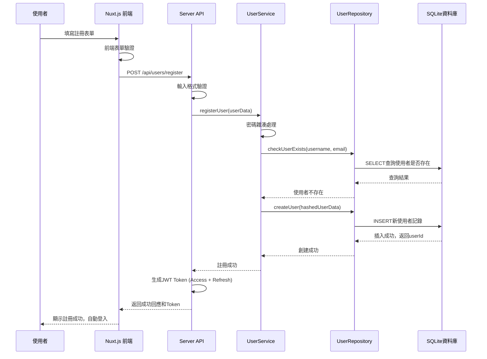
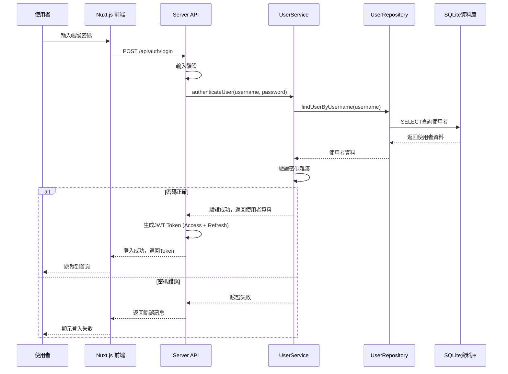
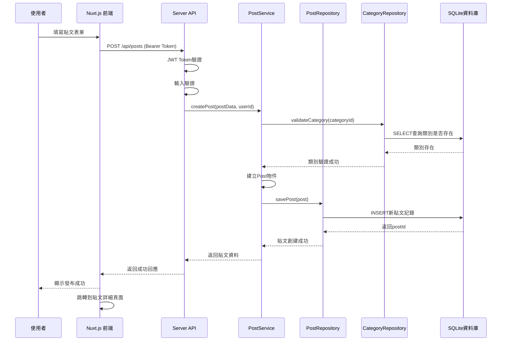
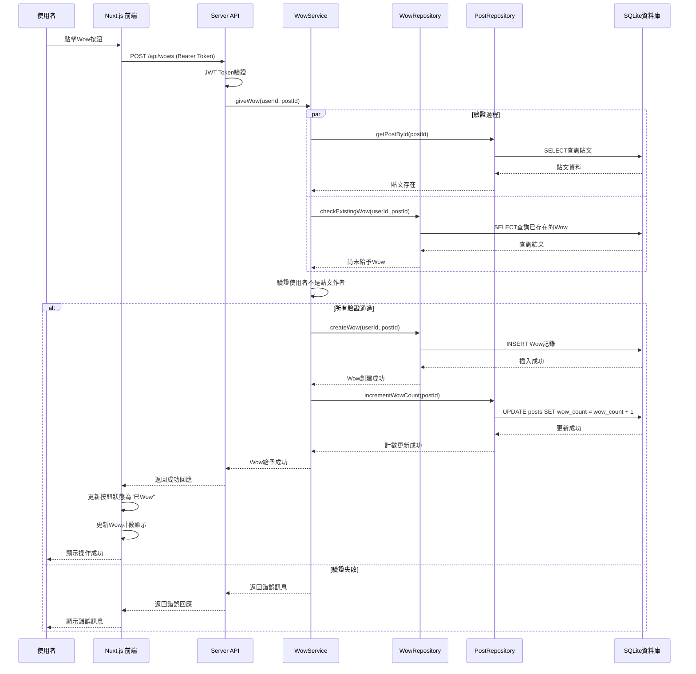
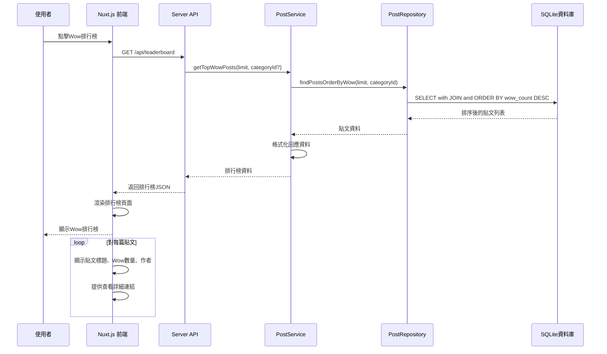
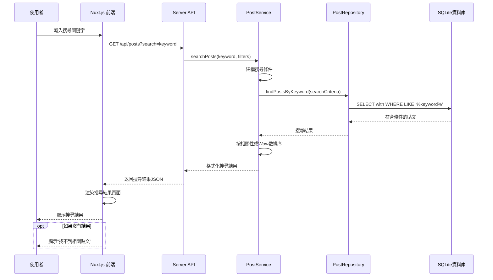
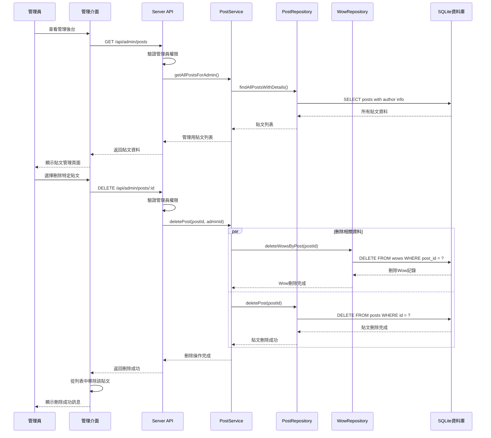
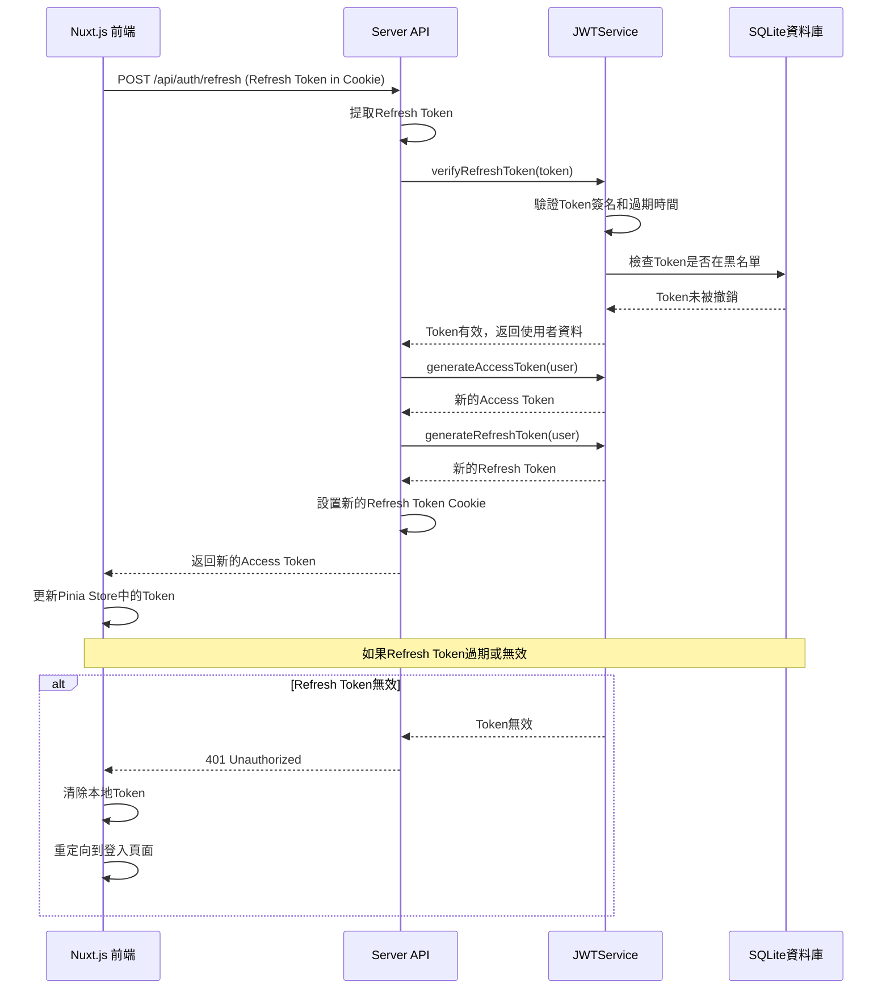

# Aotter-Wow 評價網站 - 順序圖設計

## 1. 順序圖概述

順序圖展示了系統中不同物件之間的互動順序，以時間為軸描述訊息傳遞的過程。

## 2. 核心使用案例的順序圖

### 2.1 使用者註冊流程

---

### 2.2 使用者登入流程

---

### 2.3 發布貼文流程

---

### 2.4 給予Wow評價流程

---

### 2.5 查看Wow排行榜流程

---

### 2.6 搜尋貼文流程

---

### 2.7 管理員刪除不當內容流程

## 3. 系統互動模式分析

### 3.1 同步vs異步操作

**同步操作**
- 使用者登入/註冊
- 發布貼文
- 給予Wow評價
- 管理操作

**異步潛力**（未來擴展）
- 統計資料更新
- 通知推送
- 搜尋索引更新

### 3.2 錯誤處理模式

每個順序圖中都包含了錯誤處理的分支：
- 輸入驗證失敗
- 權限驗證失敗
- 業務規則違反
- 資料庫操作失敗

### 3.3 效能考量

**資料庫操作最佳化**
- 使用適當的索引
- 避免N+1查詢問題
- 批次操作的考慮

**快取策略**
- 熱門貼文快取
- JWT Token黑名單快取
- 類別資料快取

---

## SD-008: JWT Token 刷新流程

## 4. 物件互動複雜度分析

### 4.1 簡單互動（2-3個物件）
- 使用者登入
- 簡單查詢操作

### 4.2 中等複雜度（4-5個物件）
- 發布貼文
- 搜尋功能

### 4.3 複雜互動（6+個物件）
- 給予Wow評價（需要多重驗證）
- 管理員刪除操作（需要級聯刪除）

## 5. 順序圖設計原則

### 5.1 職責分離
每個層級都有明確的職責：
- Server API Handler：處理HTTP請求，驗證權限
- Service：執行業務邏輯，協調多個Repository
- Repository：封裝資料存取操作

### 5.2 錯誤傳播
錯誤從底層向上層傳播，每層都有適當的錯誤處理

### 5.3 事務一致性
涉及多個資料表的操作考慮事務的原子性

## 6. 實作考量

### 6.1 程式碼組織
順序圖指導了程式碼的組織結構，確保：
- 方法的參數和返回值設計
- 異常處理機制
- 物件間的依賴關係

### 6.2 測試策略
順序圖為單元測試和整合測試提供了清晰的測試場景

### 6.3 API設計
順序圖確保了RESTful API的一致性和完整性

## 7. 下一步驟

有了完整的順序圖設計，我們可以：
1. 開始詳細的程式碼實作
2. 建立對應的測試案例
3. 實作 Nuxt.js Server API 端點
4. 建立資料庫連接和操作邏輯
