# Aotter-Wow 評價網站 - 使用案例分析

## 1. 使用案例圖概述

### 主要參與者 (Actors)

- **一般使用者 (User)**: 註冊使用者，可以發文、評價、瀏覽內容
- **管理員 (Admin)**: 系統管理者，具有內容管理權限
- **訪客 (Guest)**: 未登入使用者，只能瀏覽公開內容

### 使用案例圖

```mermaid
flowchart LR
    %% 參與者定義 (左側)
    subgraph Actors ["👥 系統參與者"]
        direction TB
        Guest[("👤 訪客<br/>Guest")]
        User[("👨‍💼 一般使用者<br/>User")]
        Admin[("👨‍💻 管理員<br/>Admin")]
    end
    
    %% 系統邊界與功能分組 (橫向排列)
    subgraph System ["🌟 Aotter-Wow System"]
        direction LR
        
        %% 第一排功能模組
        subgraph Row1 ["上層功能"]
            direction LR
            
            subgraph Auth ["🔐 認證管理"]
                direction TB
                UC001(("UC-001<br/>註冊"))
                UC002(("UC-002<br/>登入"))
                UC003(("UC-003<br/>登出"))
                UC004(("UC-004<br/>個人資料"))
            end
            
            subgraph Content ["📝 內容管理"]
                direction TB
                UC005(("UC-005<br/>發布貼文"))
                UC006(("UC-006<br/>編輯貼文"))
                UC007(("UC-007<br/>刪除貼文"))
            end
        end
        
        %% 第二排功能模組
        subgraph Row2 ["下層功能"]
            direction LR
            
            subgraph Browse ["🔍 內容瀏覽"]
                direction TB
                UC008(("UC-008<br/>瀏覽貼文"))
                UC011(("UC-011<br/>搜尋貼文"))
                UC013(("UC-013<br/>類別瀏覽"))
            end
            
            subgraph Rating ["⭐ 評價系統"]
                direction TB
                UC009(("UC-009<br/>Wow評價"))
                UC010(("UC-010<br/>Wow統計"))
                UC012(("UC-012<br/>排行榜"))
            end
            
            subgraph Management ["⚙️ 系統管理"]
                direction TB
                UC014(("UC-014<br/>管理內容"))
                UC015(("UC-015<br/>系統統計"))
            end
        end
    end
    
    %% 參與者與功能的連接 (簡化線條)
    Actors -.-> Auth
    Actors -.-> Browse
    
    User -.-> Content
    User -.-> Rating
    
    Admin -.-> Management
    
    %% 重要的包含關係
    Content -.->|需要登入| Auth
    Rating -.->|需要登入| Auth
    Management -.->|需要登入| Auth
    
    %% 擴展關係
    Rating -.->|擴展| Browse
```

### 分層使用案例圖（按角色分組）

### 功能模組互動圖

## 2. 使用案例列表

### 2.1 使用者管理相關
- **UC-001**: 使用者註冊
- **UC-002**: 使用者登入
- **UC-003**: 使用者登出
- **UC-004**: 查看個人資料

### 2.2 內容管理相關
- **UC-005**: 發布貼文
- **UC-006**: 編輯貼文
- **UC-007**: 刪除貼文
- **UC-008**: 瀏覽貼文

### 2.3 評價相關
- **UC-009**: 給予 Wow 評價
- **UC-010**: 查看 Wow 統計

### 2.4 內容發現相關
- **UC-011**: 搜尋貼文
- **UC-012**: 查看 Wow 排行榜
- **UC-013**: 依類別瀏覽

### 2.5 管理功能相關
- **UC-014**: 管理不當內容
- **UC-015**: 查看系統統計

## 3. 詳細使用案例描述

### UC-001: 使用者註冊

**主要參與者**: 訪客  
**前置條件**: 使用者尚未擁有帳號  
**成功條件**: 使用者成功建立帳號並可登入  

**主要流程**:
1. 訪客點擊「註冊」按鈕
2. 系統顯示註冊表單
3. 訪客填寫使用者名稱、Email、密碼
4. 訪客提交註冊表單
5. 系統驗證資料格式和唯一性
6. 系統建立新使用者帳號
7. 系統顯示註冊成功訊息
8. 系統自動登入使用者

**替代流程**:
- 5a. 使用者名稱已存在
  - 5a1. 系統顯示錯誤訊息
  - 5a2. 返回步驟 3
- 5b. Email 已存在或格式錯誤
  - 5b1. 系統顯示錯誤訊息
  - 5b2. 返回步驟 3

---

### UC-005: 發布貼文

**主要參與者**: 一般使用者  
**前置條件**: 使用者已登入  
**成功條件**: 貼文成功發布並可被其他使用者瀏覽  

**主要流程**:
1. 使用者點擊「發布貼文」按鈕
2. 系統顯示貼文編輯表單
3. 使用者輸入貼文標題
4. 使用者輸入貼文內容
5. 使用者選擇貼文類別（動物、美食、旅遊等）
6. 使用者點擊「發布」按鈕
7. 系統驗證輸入資料
8. 系統儲存貼文
9. 系統顯示發布成功訊息
10. 系統導向至貼文詳細頁面

**替代流程**:
- 7a. 標題或內容為空
  - 7a1. 系統顯示錯誤訊息
  - 7a2. 返回步驟 3

---

### UC-009: 給予 Wow 評價

**主要參與者**: 一般使用者  
**前置條件**: 使用者已登入，且正在瀏覽他人的貼文  
**成功條件**: Wow 評價成功記錄，貼文的 Wow 數量增加  

**主要流程**:
1. 使用者瀏覽貼文詳細頁面
2. 使用者點擊「Wow」按鈕
3. 系統檢查使用者是否已對此貼文給過 Wow
4. 系統檢查貼文是否為使用者自己發布
5. 系統記錄 Wow 評價
6. 系統更新貼文的 Wow 計數
7. 系統更新按鈕狀態為「已 Wow」
8. 系統顯示更新後的 Wow 數量

**替代流程**:
- 3a. 使用者已對此貼文給過 Wow
  - 3a1. 系統顯示「您已經給過 Wow 了」訊息
  - 3a2. 使用案例結束
- 4a. 貼文是使用者自己發布的
  - 4a1. 系統顯示「不能對自己的貼文給 Wow」訊息
  - 4a2. 使用案例結束

---

### UC-012: 查看 Wow 排行榜

**主要參與者**: 一般使用者、訪客  
**前置條件**: 系統中有貼文存在  
**成功條件**: 使用者可以看到按 Wow 數量排序的貼文列表  

**主要流程**:
1. 使用者點擊「Wow 排行榜」連結
2. 系統查詢所有貼文並按 Wow 數量排序
3. 系統顯示排行榜頁面
4. 使用者可以查看排名、貼文標題、Wow 數量
5. 使用者可以點擊貼文標題查看詳細內容

**替代流程**:
- 2a. 沒有貼文存在
  - 2a1. 系統顯示「目前沒有貼文」訊息

---

### UC-014: 管理不當內容

**主要參與者**: 管理員  
**前置條件**: 管理員已登入  
**成功條件**: 不當內容被移除或標記  

**主要流程**:
1. 管理員進入管理後台
2. 系統顯示所有貼文列表
3. 管理員識別不當內容
4. 管理員選擇要處理的貼文
5. 管理員選擇處理動作（刪除、隱藏）
6. 系統執行管理動作
7. 系統記錄管理日誌
8. 系統顯示處理完成訊息

## 4. 使用案例關係

### 包含關係 (Include)
- UC-005 (發布貼文) 包含 驗證使用者身份
- UC-009 (給予 Wow 評價) 包含 驗證使用者身份

### 擴展關係 (Extend)
- UC-008 (瀏覽貼文) 擴展 UC-009 (給予 Wow 評價)
- UC-012 (查看 Wow 排行榜) 擴展 UC-008 (瀏覽貼文)

## 5. 非功能需求對使用案例的影響

### 效能需求
- UC-012 (查看 Wow 排行榜): 排序查詢應在 2 秒內完成
- UC-008 (瀏覽貼文): 頁面載入應在 3 秒內完成

### 可用性需求
- 所有使用案例的介面都應該直觀易用
- 錯誤訊息應該清楚明確

## 6. 下一階段

完成使用案例分析後，接下來將進行：
1. 領域模型分析
2. 概念類別圖設計
3. 系統架構規劃
