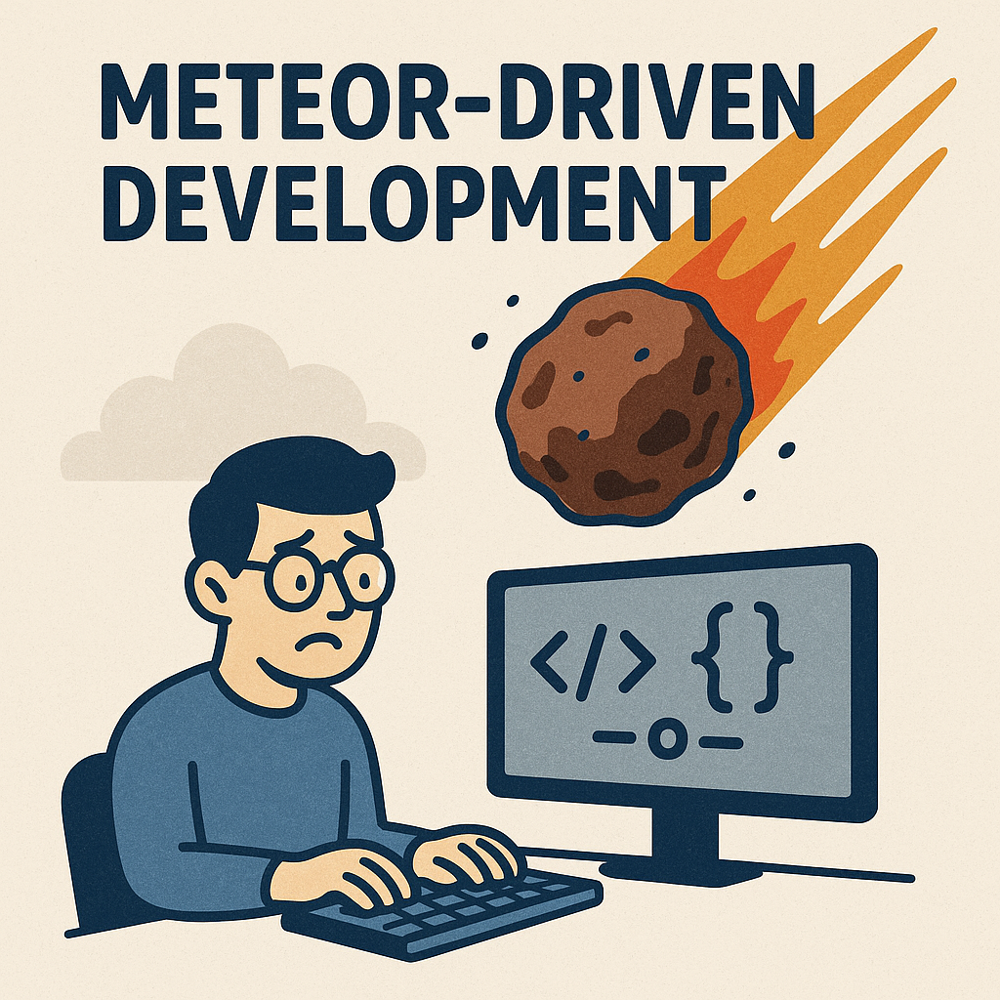
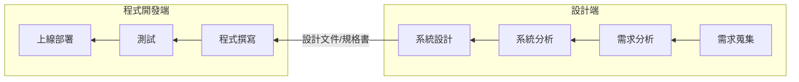
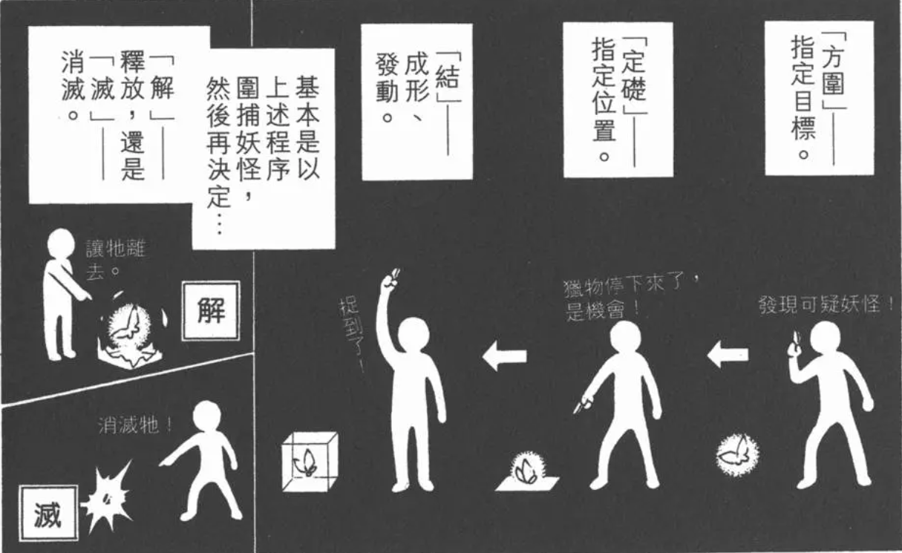
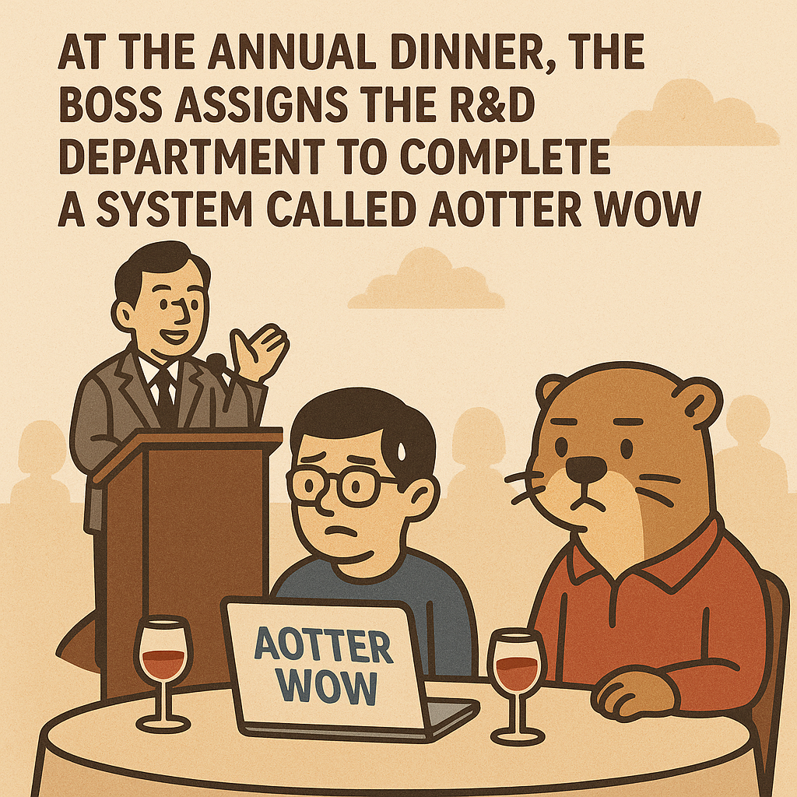
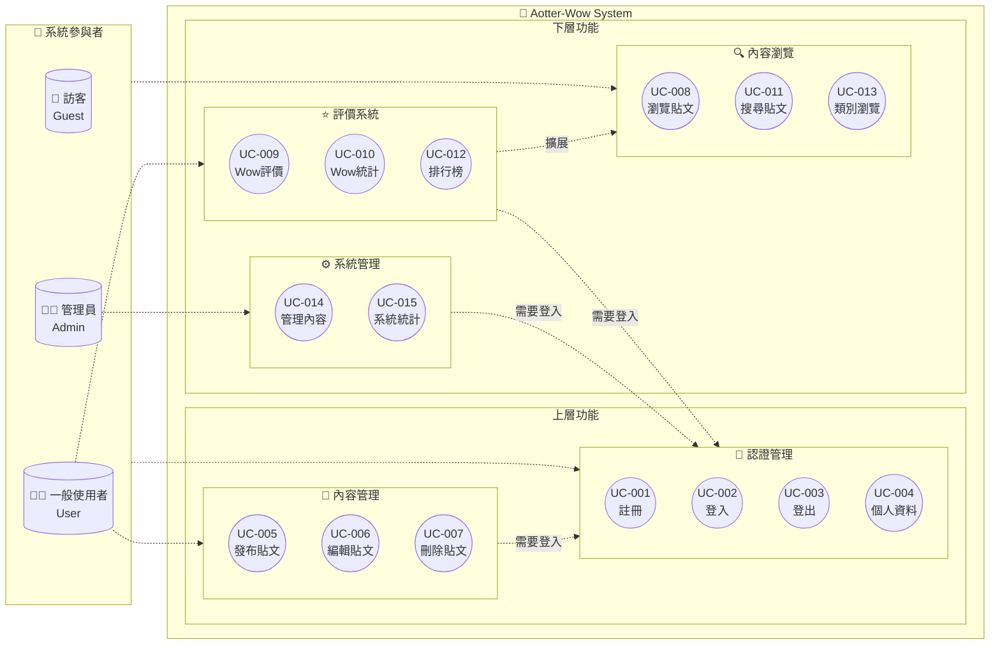
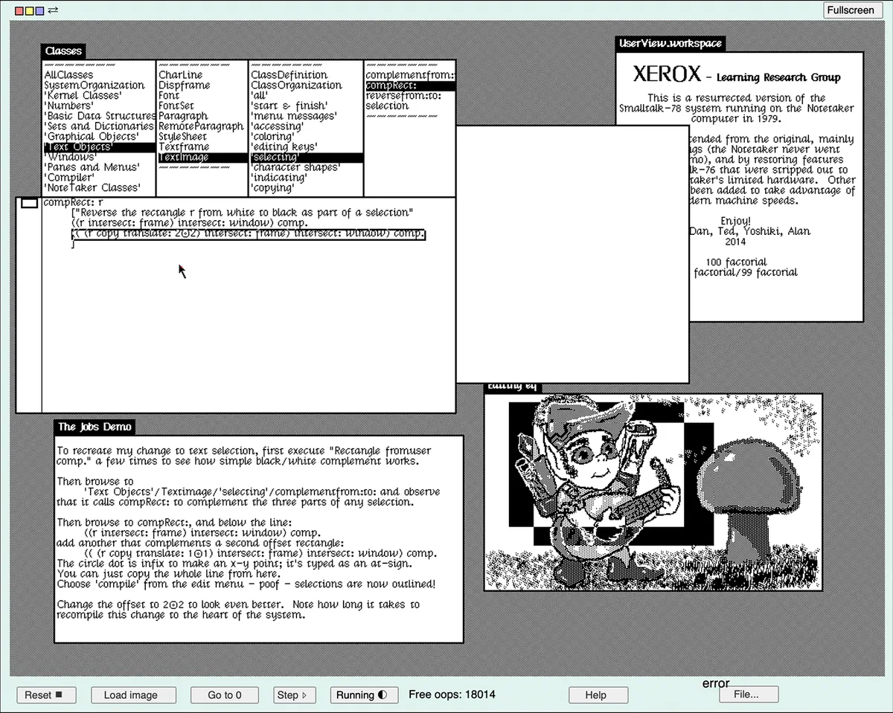
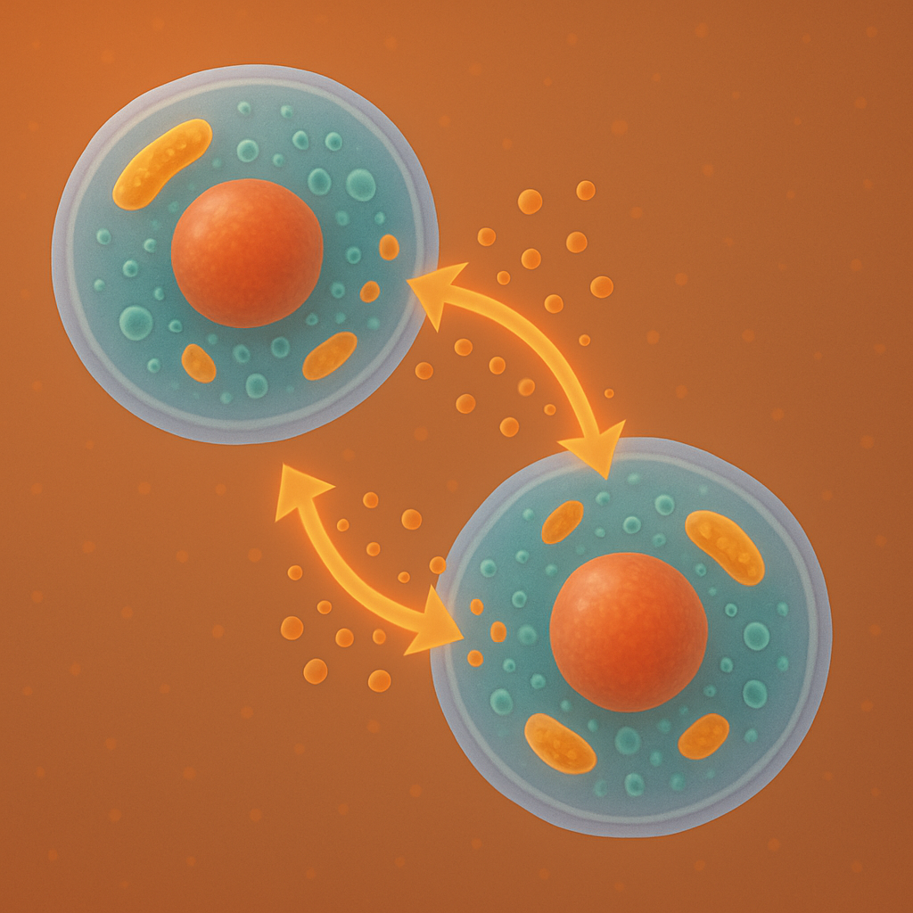
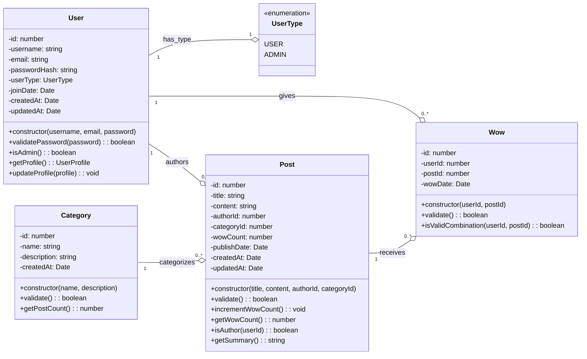
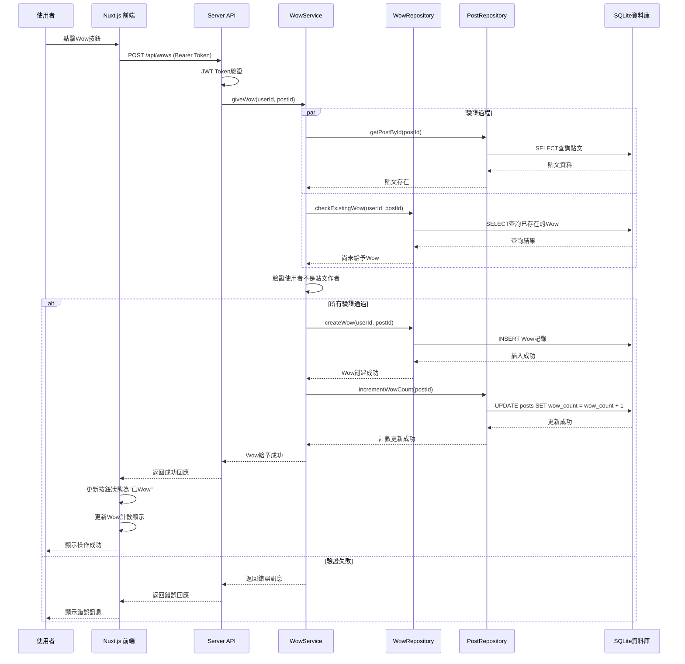
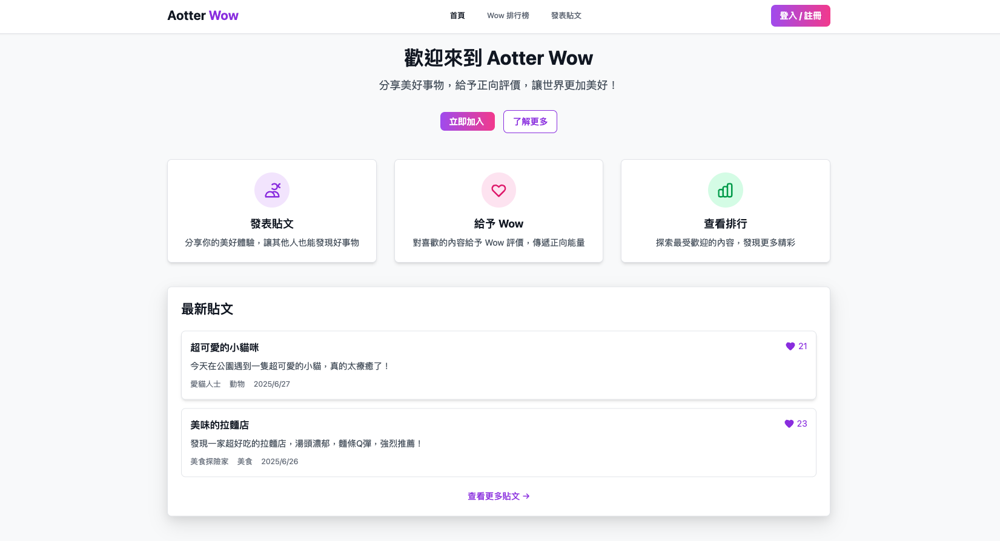

---
# You can also start simply with 'default'
theme: seriph
# random image from a curated Unsplash collection by Anthony
# like them? see https://unsplash.com/collections/94734566/slidev
background: https://cover.sli.dev
# some information about your slides (markdown enabled)
title: Welcome to Slidev
info: |
  ## Slidev Starter Template
  Presentation slides for developers.

  Learn more at [Sli.dev](https://sli.dev)
# apply unocss classes to the current slide
class: text-center
# https://sli.dev/features/drawing
drawings:
  persist: false
# slide transition: https://sli.dev/guide/animations.html#slide-transitions
transition: slide-left
# enable MDC Syntax: https://sli.dev/features/mdc
mdc: true
# open graph
# seoMeta:
#  ogImage: https://cover.sli.dev
---

# 專案文件與 AI

AI 可以寫扣，那也可以寫專案開發的文件吧

  Press Space for next page <carbon:arrow-right />

  <button @click="$slidev.nav.openInEditor()" title="Open in Editor" class="slidev-icon-btn">
    <carbon:edit />
  </button>
  <a href="https://github.com/slidevjs/slidev" target="_blank" class="slidev-icon-btn">
    <carbon:logo-github />
  </a>

<!--
The last comment block of each slide will be treated as slide notes. It will be visible and editable in Presenter Mode along with the slide. [Read more in the docs](https://sli.dev/guide/syntax.html#notes)
-->

---

# 動機

  

 

- 買了一堂在講 OOAD 的課
- 本來 RD Sharing 時想手動畫圖來講
- 但剛好公司有給 Github Copilot 的 seat
- 那乾脆就兩個混在一起講好了，叫 A幫我幫我畫圖

<!--
You can have `style` tag in markdown to override the style for the current page.
Learn more: https://sli.dev/features/slide-scope-style
-->

---

# 專案的源頭

甲方/老闆：我想要某個東西，
需求、畫面、程式你都要做好。
東西明天給我，OK 吧

我：...

---

# 軟體開發的生命週期

  

---

# 領取 ~~隕石~~ 任務

老闆：我尾牙猜題活動不小心給錯選項，研發部明年生出一個 Aotter Wow 系統可以吧

研發部：...

---

# 概念發想

能讓使用者發出 Wow 的驚嘆

- 本來想做個可愛動物園系統，讓使用者看到都能 Wow
- 但想不到要怎麼做成程式
- 就魔轉成評價系統，讓使用者可以按 Wow

---

# 名詞介紹

- USE CASE
- OO / OOP
- OOAD

---

# Use Case

---

# OO

名人講 OO

<iframe width="560" height="315" src="https://www.youtube.com/embed/BQtROdysZwc?si=AiaeaErvh1kzHEhB" title="YouTube video player" frameborder="0" allow="accelerometer; autoplay; clipboard-write; encrypted-media; gyroscope; picture-in-picture; web-share" referrerpolicy="strict-origin-when-cross-origin" allowfullscreen></iframe>

<!-- 
https://www.youtube.com/watch?v=BQtROdysZwc
-->

---

# OO & OOP (1)

OOP，物件導向程式設計。將程式中的一切視為物件

OOP 概念緣起：Simula, Smalltalk (1969 ~ 1972 Xerox PARC; Alan Kay, etc)

<!-- 
  賈伯斯的 mac 介面聽說偷抄 smalltalk
  https://spectrum.ieee.org/vera-rubin-observatory-first-images
 -->

---

# OO & OOP (2)

Alan Kay: 我從 Cell 想出了 OOP 這個概念

- 保持狀態
- 從自身或物件接收訊息
- 接收訊息時，將訊息傳給自身或另一個物件

  

  電獺
  - 狀態
    - 員工 xx 人
    - 戰力 xx
  - 能力
    - 辦運動會
    -  比賽

  

  

  雷虎
  - 狀態
    - 員工 oo 人
    - 戰力 oo
  - 能力
    - 比賽

  

<!-- 
https://www.reddit.com/r/programming/comments/12pr8r/til_alan_kay_a_pioneer_in_developing/
-->

---

# OOAD

物件導向分析、設計大概在 1990 中期發展的，軟體開發、物件導向建模方法論。常使用 UML

物件導向分析 (靜態)
- 替真實世界建立模型
- 物件被賦予的職責
- 物件可以做哪些事情、可以有什麼狀態
- 常使用類別圖

物件導向設計 (動態)
- 如何安排、使用這些物件，來解決真實世界的問題
- 常使用循序圖

<!-- 
https://en.wikipedia.org/wiki/Object-oriented_analysis_and_design
-->

---

# OOA

---

# OOD

---

# 還沒完成的網站 Demo

---

# 小結

<v-clicks>

- OOAD 感覺比較適合小型的程式開發 (可能是我還沒很懂)
- 可以嘗試建立 project template prompt。可能還需要
  - 網站地圖
  - 線稿圖 (或用 MCP + Figma 幫產 wireframe / mockup)
- 之後試看看 gemini cli 看看，不然要一直確認指令滿麻煩的

</v-clicks>