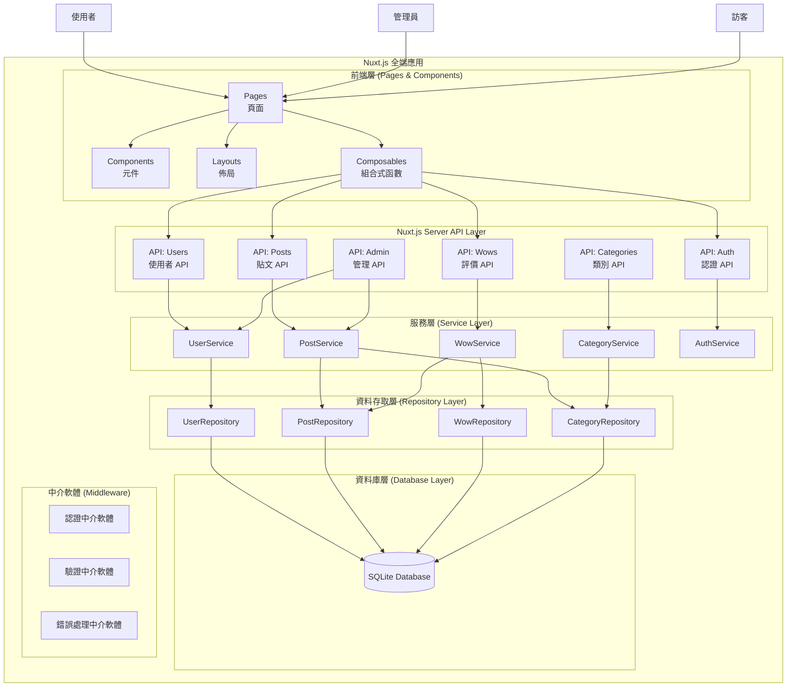

# Aotter-Wow 評價網站 - 系統架構設計

## 1. 架構概述

### 1.1 整體架構風格
採用 **分層架構 (Layered Architecture)** 結合 **MVC 模式**，適合 Demo 級別的 Web 應用程式。

### 1.2 技術選型

**全端框架**

- Nuxt.js 3 (Vue.js 全端框架)
- TypeScript (型別安全)
- Tailwind CSS (實用優先的 CSS 框架)
- Vite (快速建置工具，內建於 Nuxt.js)

**後端技術 (Nuxt.js Server)**

- Nuxt.js Server API (伺服器端 API)
- H3 (高效能 HTTP 框架，Nuxt.js 內建)
- TypeScript (型別安全)
- SQLite 3 (輕量級資料庫)
- JWT (JSON Web Token) 認證
- bcrypt (密碼雜湊)

**開發工具**

- npm/pnpm (套件管理)
- Vite (建置工具)
- ESLint + Prettier (程式碼品質)
- Vue DevTools (Vue.js 開發工具)

## 2. 系統分層架構



### 2.1 表現層 (Presentation Layer)

**職責**
- 處理 HTTP 請求和回應
- 路由管理
- 使用者界面渲染
- 輸入驗證

**主要元件**
- `UserController`: 處理使用者相關請求
- `PostController`: 處理貼文相關請求  
- `WowController`: 處理評價相關請求
- `CategoryController`: 處理類別相關請求

### 2.2 服務層 (Service Layer)

**職責**
- 實作業務邏輯
- 協調多個資料存取操作
- 執行業務規則驗證
- 處理領域事件

**主要元件**
- `UserService`: 使用者管理業務邏輯
- `PostService`: 貼文管理業務邏輯
- `WowService`: 評價系統業務邏輯
- `CategoryService`: 類別管理業務邏輯

### 2.3 資料存取層 (Repository Layer)

**職責**
- 資料庫操作封裝
- 資料持久化
- 查詢最佳化
- 資料轉換

**主要元件**
- `UserRepository`: 使用者資料存取
- `PostRepository`: 貼文資料存取
- `WowRepository`: 評價資料存取
- `CategoryRepository`: 類別資料存取

### 2.4 資料庫層 (Database Layer)

**設計原則**
- 使用 SQLite 輕量級資料庫
- 適當的索引設計
- 外鍵約束確保資料完整性

## 3. 目錄結構設計

### 3.1 專案目錄樹狀圖

```mermaid
flowchart TD
    Root[aotter-wow-system/]
    
    Root --> Package[package.json]
    Root --> NuxtConfig[nuxt.config.ts]
    Root --> TailwindConfig[tailwind.config.js]
    Root --> TSConfig[tsconfig.json]
    Root --> Tests[tests/]
    
    subgraph "Nuxt.js 全端應用結構"
        Root --> Pages[pages/]
        Root --> Components[components/]
        Root --> Layouts[layouts/]
        Root --> Composables[composables/]
        Root --> Server[server/]
        Root --> Assets[assets/]
        Root --> Public[public/]
        Root --> Types[types/]
        Root --> Utils[utils/]
        Root --> Plugins[plugins/]
        Root --> Middleware[middleware/]
        
        subgraph "前端頁面與元件"
            Pages --> IndexPage[index.vue]
            Pages --> LoginPage[login.vue]
            Pages --> PostsPage[posts/]
            Pages --> ProfilePage[profile.vue]
            Pages --> AdminPage[admin/]
            
            Components --> CommonComponents[common/]
            Components --> UserComponents[user/]
            Components --> PostComponents[post/]
            Components --> WowComponents[wow/]
            
            Layouts --> DefaultLayout[default.vue]
            Layouts --> AdminLayout[admin.vue]
            
            Composables --> UseAuth[useAuth.ts]
            Composables --> UseUser[useUser.ts]
            Composables --> UsePost[usePost.ts]
            Composables --> UseWow[useWow.ts]
        end
        
        subgraph "Nuxt.js Server API"
            Server --> API[api/]
            Server --> Services[services/]
            Server --> Repositories[repositories/]
            Server --> Models[models/]
            Server --> Database[database/]
            Server --> ServerMiddleware[middleware/]
            Server --> ServerUtils[utils/]
            
            API --> UsersAPI[users/]
            API --> PostsAPI[posts/]
            API --> WowsAPI[wows/]
            API --> AuthAPI[auth/]
            API --> CategoriesAPI[categories/]
            API --> AdminAPI[admin/]
            
            Services --> UserService[UserService.ts]
            Services --> PostService[PostService.ts]
            Services --> WowService[WowService.ts]
            Services --> AuthService[AuthService.ts]
            
            Repositories --> UserRepo[UserRepository.ts]
            Repositories --> PostRepo[PostRepository.ts]
            Repositories --> WowRepo[WowRepository.ts]
            Repositories --> CategoryRepo[CategoryRepository.ts]
            
            Database --> InitDB[init.sql]
            Database --> SeedDB[seed.sql]
            Database --> Migration[migrations/]
        end
    end
    
    Tests --> FrontendTests[unit/]
    Tests --> BackendTests[component/]
    Tests --> E2ETests[e2e/]
```



### 3.2 詳細目錄結構

```
aotter-wow-system/
├── package.json
├── tsconfig.json
├── vite.config.ts
├── tailwind.config.js
├── postcss.config.js
├── pages/                   # Nuxt.js 頁面路由
│   ├── index.vue            # 首頁
│   ├── login.vue            # 登入頁面
│   ├── register.vue         # 註冊頁面
│   ├── posts/
│   │   ├── index.vue        # 貼文列表
│   │   └── [id].vue         # 貼文詳情
│   ├── profile.vue          # 個人資料
│   ├── leaderboard.vue      # 排行榜
│   └── admin/
│       ├── index.vue        # 管理後台首頁
│       ├── posts.vue        # 貼文管理
│       └── users.vue        # 使用者管理
│
├── components/              # Vue 元件
│   ├── common/
│   │   ├── AppHeader.vue
│   │   ├── AppFooter.vue
│   │   ├── AppNavigation.vue
│   │   ├── Loading.vue
│   │   └── Modal.vue
│   ├── user/
│   │   ├── LoginForm.vue
│   │   ├── RegisterForm.vue
│   │   └── UserProfile.vue
│   ├── post/
│   │   ├── PostCard.vue
│   │   ├── PostForm.vue
│   │   ├── PostList.vue
│   │   └── PostDetail.vue
│   └── wow/
│       ├── WowButton.vue
│       ├── WowCounter.vue
│       └── WowLeaderboard.vue
│
├── layouts/                 # Nuxt.js 佈局
│   ├── default.vue          # 預設佈局
│   └── admin.vue            # 管理後台佈局
│
├── composables/             # Nuxt.js 組合式函數
│   ├── useAuth.ts
│   ├── useUser.ts
│   ├── usePost.ts
│   ├── useWow.ts
│   └── useApi.ts
│
├── stores/                  # Pinia 狀態管理
│   ├── auth.ts
│   ├── user.ts
│   ├── post.ts
│   └── wow.ts
│
├── types/                   # TypeScript 型別定義
│   ├── auth.ts
│   ├── user.ts
│   ├── post.ts
│   └── api.ts
│
├── utils/                   # 工具函數
│   ├── api.ts
│   ├── format.ts
│   └── validation.ts
│
├── assets/                  # 靜態資源
│   ├── css/
│   │   └── main.css
│   └── images/
│
├── public/                  # 公共靜態檔案
│   ├── favicon.ico
│   └── images/
│
├── server/                  # Nuxt.js Server API
│   ├── package.json
│   ├── tsconfig.json
│   ├── api/                 # Nuxt.js Server API 路由
│   │   ├── users/
│   │   │   ├── index.get.ts     # GET /api/users
│   │   │   ├── index.post.ts    # POST /api/users (註冊)
│   │   │   ├── [id].get.ts      # GET /api/users/:id
│   │   │   ├── [id].put.ts      # PUT /api/users/:id
│   │   │   └── [id].delete.ts   # DELETE /api/users/:id
│   │   ├── auth/
│   │   │   ├── login.post.ts    # POST /api/auth/login
│   │   │   ├── logout.post.ts   # POST /api/auth/logout
│   │   │   └── refresh.post.ts  # POST /api/auth/refresh
│   │   ├── posts/
│   │   │   ├── index.get.ts     # GET /api/posts
│   │   │   ├── index.post.ts    # POST /api/posts
│   │   │   ├── [id].get.ts      # GET /api/posts/:id
│   │   │   ├── [id].put.ts      # PUT /api/posts/:id
│   │   │   └── [id].delete.ts   # DELETE /api/posts/:id
│   │   ├── wows/
│   │   │   ├── index.post.ts    # POST /api/wows
│   │   │   └── [id].delete.ts   # DELETE /api/wows/:id
│   │   ├── categories/
│   │   │   ├── index.get.ts     # GET /api/categories
│   │   │   └── index.post.ts    # POST /api/categories
│   │   └── leaderboard/
│   │       └── index.get.ts     # GET /api/leaderboard
│   │
│   ├── services/            # 服務層
│   │   ├── UserService.ts
│   │   ├── PostService.ts
│   │   ├── WowService.ts
│   │   └── CategoryService.ts
│   │
│   ├── repositories/        # 資料存取層
│   │   ├── UserRepository.ts
│   │   ├── PostRepository.ts
│   │   ├── WowRepository.ts
│   │   └── CategoryRepository.ts
│   │
│   ├── models/              # 領域模型
│   │   ├── User.ts
│   │   ├── Post.ts
│   │   ├── Wow.ts
│   │   └── Category.ts
│   │
│   ├── database/            # 資料庫相關
│   │   ├── connection.ts
│   │   ├── migrations/
│   │   └── seeds/
│   │
│   └── middleware/          # Server 中介軟體
│       ├── auth.ts
│       ├── validation.ts
│       └── cors.ts
│
├── middleware/              # Nuxt.js 路由中介軟體
│   ├── auth.ts              # 身份驗證中介軟體
│   └── admin.ts             # 管理員權限中介軟體
│
├── plugins/                 # Nuxt.js 插件
│   ├── api.client.ts        # API 客戶端
│   └── auth.client.ts       # 認證插件
│
├── database/                # SQLite 資料庫檔案
│   └── aotter-wow.db
│
└── tests/                   # 測試檔案
    ├── unit/                # 單元測試
    ├── component/           # 元件測試
    └── e2e/                 # 端對端測試
```

## 4. API 設計

### 4.1 Nuxt.js Server API 端點

**使用者相關 (server/api/users/)**
```
POST   /api/users/register.post.ts     # 使用者註冊
GET    /api/users/profile.get.ts       # 獲取個人資料 (需認證)
PUT    /api/users/profile.put.ts       # 更新個人資料 (需認證)
```

**認證相關 (server/api/auth/)**
```
POST   /api/auth/login.post.ts         # 使用者登入
POST   /api/auth/logout.post.ts        # 使用者登出
POST   /api/auth/refresh.post.ts       # 刷新 JWT Token
```

**貼文相關 (server/api/posts/)**
```
GET    /api/posts/index.get.ts         # 獲取貼文列表
POST   /api/posts/index.post.ts        # 建立新貼文
GET    /api/posts/:id          # 獲取特定貼文
PUT    /api/posts/:id          # 更新貼文
DELETE /api/posts/:id          # 刪除貼文
GET    /api/posts/top-wow      # 獲取 Wow 排行榜
```

**評價相關**
```
POST   /api/posts/:id/wow      # 給予 Wow 評價
GET    /api/posts/:id/wows     # 獲取貼文的 Wow 列表
```

**類別相關**
```
GET    /api/categories         # 獲取所有類別
GET    /api/categories/:id/posts # 獲取特定類別的貼文
```

### 4.2 回應格式標準

**成功回應**
```json
{
  "success": true,
  "data": { ... },
  "message": "操作成功"
}
```

**錯誤回應**
```json
{
  "success": false,
  "error": {
    "code": "VALIDATION_ERROR",
    "message": "輸入資料格式錯誤",
    "details": { ... }
  }
}
```

## 5. 資料庫設計

### 5.1 資料表結構

**users 資料表**
```sql
CREATE TABLE users (
    id INTEGER PRIMARY KEY AUTOINCREMENT,
    username VARCHAR(50) UNIQUE NOT NULL,
    email VARCHAR(255) UNIQUE NOT NULL,
    password_hash VARCHAR(255) NOT NULL,
    user_type VARCHAR(20) DEFAULT 'USER',
    join_date DATETIME DEFAULT CURRENT_TIMESTAMP,
    created_at DATETIME DEFAULT CURRENT_TIMESTAMP,
    updated_at DATETIME DEFAULT CURRENT_TIMESTAMP
);
```

**categories 資料表**
```sql
CREATE TABLE categories (
    id INTEGER PRIMARY KEY AUTOINCREMENT,
    name VARCHAR(50) UNIQUE NOT NULL,
    description TEXT,
    created_at DATETIME DEFAULT CURRENT_TIMESTAMP
);
```

**posts 資料表**
```sql
CREATE TABLE posts (
    id INTEGER PRIMARY KEY AUTOINCREMENT,
    title VARCHAR(255) NOT NULL,
    content TEXT NOT NULL,
    author_id INTEGER NOT NULL,
    category_id INTEGER NOT NULL,
    wow_count INTEGER DEFAULT 0,
    publish_date DATETIME DEFAULT CURRENT_TIMESTAMP,
    created_at DATETIME DEFAULT CURRENT_TIMESTAMP,
    updated_at DATETIME DEFAULT CURRENT_TIMESTAMP,
    FOREIGN KEY (author_id) REFERENCES users(id),
    FOREIGN KEY (category_id) REFERENCES categories(id)
);
```

**wows 資料表**
```sql
CREATE TABLE wows (
    id INTEGER PRIMARY KEY AUTOINCREMENT,
    user_id INTEGER NOT NULL,
    post_id INTEGER NOT NULL,
    wow_date DATETIME DEFAULT CURRENT_TIMESTAMP,
    FOREIGN KEY (user_id) REFERENCES users(id),
    FOREIGN KEY (post_id) REFERENCES posts(id),
    UNIQUE(user_id, post_id)
);
```

**token_blacklist 資料表** (JWT Token 管理)
```sql
CREATE TABLE token_blacklist (
    id INTEGER PRIMARY KEY AUTOINCREMENT,
    token_jti VARCHAR(255) NOT NULL UNIQUE,  -- JWT ID
    user_id INTEGER NOT NULL,
    token_type VARCHAR(20) NOT NULL,  -- 'refresh' or 'access'
    expires_at DATETIME NOT NULL,
    revoked_at DATETIME DEFAULT CURRENT_TIMESTAMP,
    FOREIGN KEY (user_id) REFERENCES users(id)
);
```

### 5.2 索引設計

```sql
-- 提升查詢效能的索引
CREATE INDEX idx_posts_author_id ON posts(author_id);
CREATE INDEX idx_posts_category_id ON posts(category_id);
CREATE INDEX idx_posts_wow_count ON posts(wow_count DESC);
CREATE INDEX idx_posts_publish_date ON posts(publish_date DESC);
CREATE INDEX idx_wows_user_id ON wows(user_id);
CREATE INDEX idx_wows_post_id ON wows(post_id);

-- JWT Token 黑名單相關索引
CREATE INDEX idx_token_blacklist_jti ON token_blacklist(token_jti);
CREATE INDEX idx_token_blacklist_user_id ON token_blacklist(user_id);
CREATE INDEX idx_token_blacklist_expires_at ON token_blacklist(expires_at);
```

## 6. 安全性設計

### 6.1 認證與授權

**JWT Token 認證**
- 使用 JSON Web Token (JWT) 進行無狀態認證
- 登入成功後返回 Access Token 和 Refresh Token
- Access Token 有效期：15分鐘，Refresh Token 有效期：7天
- 使用 RS256 演算法進行 Token 簽名

**Token 管理策略**
- Access Token 存儲在前端記憶體中 (Pinia Store)
- Refresh Token 存儲在 httpOnly Cookie 中
- 自動 Token 刷新機制
- 登出時將 Refresh Token 加入黑名單

**密碼安全**
- 使用 bcrypt 進行密碼雜湊
- 不存儲明文密碼

### 6.2 輸入驗證

**前端驗證**
- HTML5 表單驗證
- JavaScript 即時驗證

**後端驗證**
- 使用 express-validator 進行資料驗證
- SQL 注入防護
- XSS 攻擊防護

## 7. 效能考量

### 7.1 快取策略
- 熱門貼文的快取（記憶體快取）
- 類別列表快取
- Wow 計數的適度快取

### 7.2 查詢最佳化
- 適當的資料庫索引
- 分頁載入機制
- 避免 N+1 查詢問題

## 8. 部署架構

### 8.1 開發環境
- 本地開發使用 SQLite 檔案資料庫
- Vite 開發伺服器
- 熱重載支援

### 8.2 正式環境（可選）
- 靜態檔案 CDN
- Node.js 服務器
- PM2 程序管理

## 10. 詳細設計文件

### 10.1 類別圖設計
詳細的類別圖設計請參考：`docs/class-diagram.md`

**包含內容**:
- 完整的領域模型類別定義
- 服務層、資料存取層、控制層的類別結構
- 介面定義和實作關係
- DTO 和值物件設計
- 中介軟體和工具類別
- 異常處理類別層次
- 設計模式應用和 SOLID 原則體現

### 10.2 互動設計文件
詳細的順序圖設計請參考：`docs/sequence-diagram.md`

**包含內容**:
- 7個核心使用案例的詳細互動流程
- 物件間的訊息傳遞順序
- 錯誤處理分支
- 業務規則驗證過程
- 資料庫操作順序

## 11. 下一階段

完成系統架構設計、類別圖和順序圖後，接下來將進行：
1. 程式碼實作  
2. 測試案例設計
3. 使用者介面設計
4. 系統整合測試
