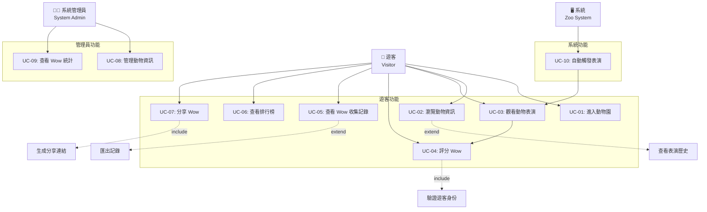
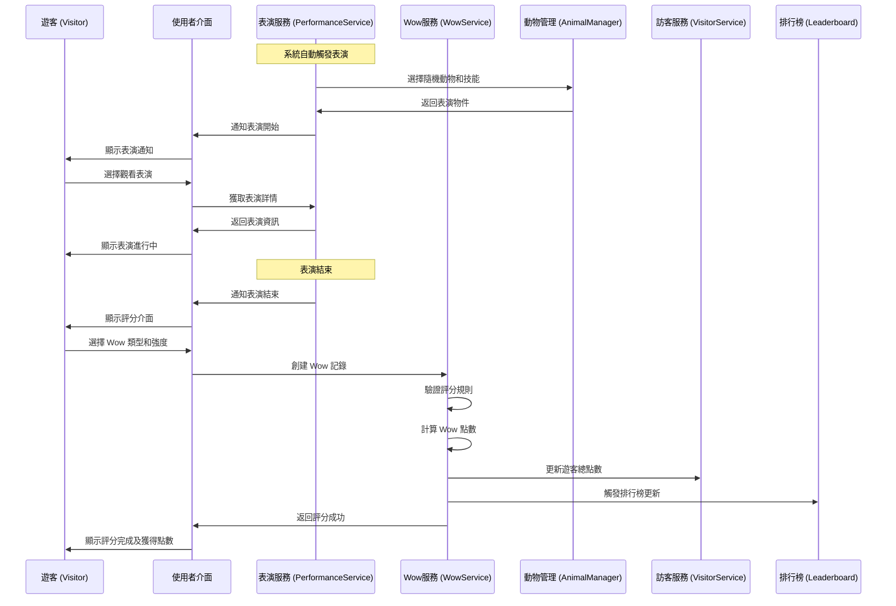
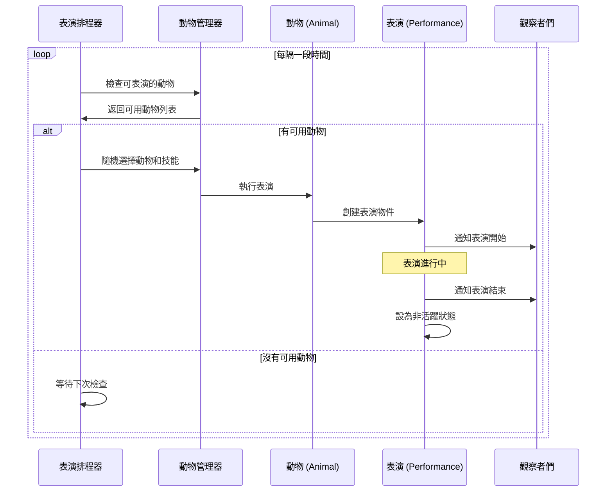

# 使用案例文件

## UML 使用案例圖

## 使用案例圖概述

本系統主要有兩類使用者：遊客（Visitor）和系統管理員（System Admin）。

## 主要使用案例

### 1. 遊客使用案例

#### UC-01: 進入動物園

**主要參與者：** 遊客  
**前置條件：** 無  
**後置條件：** 遊客成功進入系統  

**主要流程：**
1. 遊客開啟動物園系統
2. 系統提示輸入名稱
3. 遊客輸入自選名稱
4. 系統建立遊客資料
5. 系統顯示歡迎訊息和主選單

**例外流程：**
- 3a. 遊客未輸入名稱
  - 3a.1. 系統顯示錯誤訊息
  - 3a.2. 返回步驟2

#### UC-02: 瀏覽動物資訊

**主要參與者：** 遊客  
**前置條件：** 遊客已進入系統  
**後置條件：** 遊客查看到動物詳細資訊  

**主要流程：**
1. 遊客選擇「瀏覽動物」功能
2. 系統顯示所有動物列表
3. 遊客選擇特定動物
4. 系統顯示動物詳細資訊（名稱、種類、年齡、特色、技能列表）
5. 系統顯示該動物的當前表演狀態

**例外流程：**
- 2a. 系統中無動物資料
  - 2a.1. 系統顯示「目前沒有動物」訊息

#### UC-03: 觀看動物表演

**主要參與者：** 遊客  
**前置條件：** 遊客已進入系統，系統中有動物在表演  
**後置條件：** 遊客觀看了表演  

**主要流程：**
1. 系統隨機觸發動物表演
2. 系統通知有表演開始
3. 遊客選擇觀看表演
4. 系統顯示表演詳情（動物、技能、地點）
5. 表演進行中，遊客可以觀看
6. 表演結束，系統提示可以評分

**例外流程：**
- 1a. 沒有動物可以表演
  - 1a.1. 系統等待動物準備就緒

#### UC-04: 評分 Wow

**主要參與者：** 遊客  
**前置條件：** 遊客觀看了表演，且尚未對此表演評分  
**後置條件：** Wow 記錄被建立並儲存  

**主要流程：**
1. 表演結束後，系統顯示評分介面
2. 遊客選擇 Wow 類型（可愛類/技能類/互動類/驚喜類）
3. 遊客選擇強度等級（1-10分）
4. 遊客可選擇性添加評論
5. 系統確認評分
6. 系統建立 Wow 記錄
7. 系統更新遊客的總 Wow 點數
8. 系統顯示評分成功訊息

**例外流程：**
- 1a. 遊客已對此表演評分
  - 1a.1. 系統顯示「已評分」訊息
  - 1a.2. 不允許重複評分

#### UC-05: 查看 Wow 收集記錄

**主要參與者：** 遊客  
**前置條件：** 遊客已進入系統  
**後置條件：** 遊客查看到自己的收集記錄  

**主要流程：**
1. 遊客選擇「我的收集」功能
2. 系統顯示遊客的 Wow 收集統計
3. 系統顯示各類型 Wow 的數量
4. 系統顯示總 Wow 點數
5. 遊客可以選擇查看詳細記錄
6. 系統顯示每筆 Wow 的詳細資訊

#### UC-06: 查看排行榜

**主要參與者：** 遊客  
**前置條件：** 遊客已進入系統  
**後置條件：** 遊客查看到排行榜資訊  

**主要流程：**
1. 遊客選擇「排行榜」功能
2. 系統顯示排行榜選項（遊客排行榜/動物排行榜）
3. 遊客選擇要查看的排行榜
4. 系統顯示對應的排行榜資料
5. 系統顯示遊客自己的排名位置

#### UC-07: 分享 Wow

**主要參與者：** 遊客  
**前置條件：** 遊客有 Wow 記錄  
**後置條件：** Wow 被成功分享  

**主要流程：**
1. 遊客在 Wow 記錄中選擇「分享」
2. 系統生成分享連結
3. 系統顯示分享選項（複製連結/直接顯示給其他遊客）
4. 遊客選擇分享方式
5. 系統執行分享動作
6. 系統顯示分享成功訊息

### 2. 系統管理使用案例

#### UC-08: 管理動物資訊

**主要參與者：** 系統管理員  
**前置條件：** 管理員已登入系統  
**後置條件：** 動物資訊被成功管理  

**主要流程：**
1. 管理員選擇動物管理功能
2. 系統顯示動物管理選項（新增/修改/刪除/查看）
3. 管理員選擇操作類型
4. 系統顯示對應的操作介面
5. 管理員輸入或修改動物資訊
6. 系統驗證資料
7. 系統儲存變更
8. 系統顯示操作成功訊息

#### UC-09: 查看 Wow 統計

**主要參與者：** 系統管理員  
**前置條件：** 管理員已登入系統，系統中有 Wow 資料  
**後置條件：** 管理員查看到統計資訊  

**主要流程：**
1. 管理員選擇「Wow 統計」功能
2. 系統顯示統計選項（時間區間/動物/類型等）
3. 管理員設定篩選條件
4. 系統計算並顯示統計資料
5. 系統提供圖表或報表顯示

## 系統使用案例

#### UC-10: 自動觸發表演

**主要參與者：** 系統  
**前置條件：** 系統運行中，有動物資料  
**後置條件：** 表演被成功觸發  

**主要流程：**
1. 系統定期檢查表演條件
2. 系統隨機選擇動物
3. 系統檢查動物是否可以表演
4. 系統隨機選擇動物技能
5. 系統建立表演記錄
6. 系統通知所有在線遊客
7. 表演開始執行

## 使用案例關係

### 包含關係（Include）
- UC-04 評分 Wow 包含驗證遊客身份
- UC-07 分享 Wow 包含生成分享連結

### 擴展關係（Extend）
- UC-02 瀏覽動物資訊可擴展為查看表演歷史
- UC-05 查看收集記錄可擴展為匯出記錄

### 泛化關係（Generalization）
- 無明顯泛化需求

## 非功能需求相關使用案例

- **效能：** 所有查詢操作應在2秒內完成
- **可用性：** 系統應支援多位遊客同時使用
- **可靠性：** Wow 記錄不應遺失
- **安全性：** 防止惡意評分或刷分行為

## 核心流程循序圖

### Wow 評分流程

### 動物表演自動觸發流程

