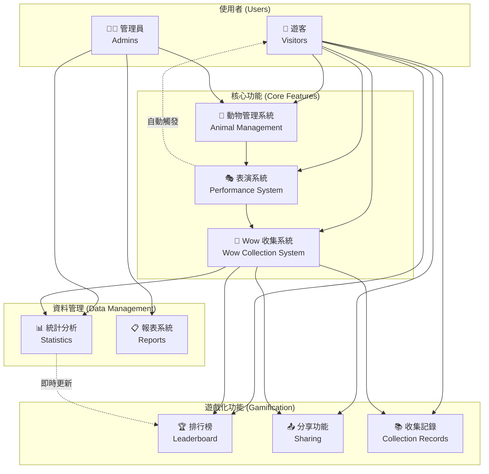
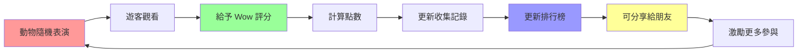

# 概念動物園 Wow 收集系統

## 系統概觀圖

## 系統特色流程

## 系統概述

這是一個以收集遊客「Wow」（驚嘆）為核心的概念動物園系統。遊客可以觀看動物表演，給予評分，收集 Wow 點數，並與其他遊客分享體驗。

## 主要功能

1. **Wow 統計管理** - 收集和分析遊客的驚嘆反應
2. **動物管理** - 管理動物資訊和技能
3. **訪客服務** - 提供遊客互動功能

## 系統特色

- Wow 分類系統（可愛類、技能類、互動類、驚喜類）
- 遊客互動功能（分享、比較）
- 遊戲化元素（點數、排行榜）
- 隨機動物表演系統
- 即時評分機制

## 開發文件

- [需求分析](./docs/requirements.md)
- [類別圖](./docs/class-diagram.md)
- [使用案例](./docs/use-cases.md)
- [系統架構](./docs/architecture.md)
