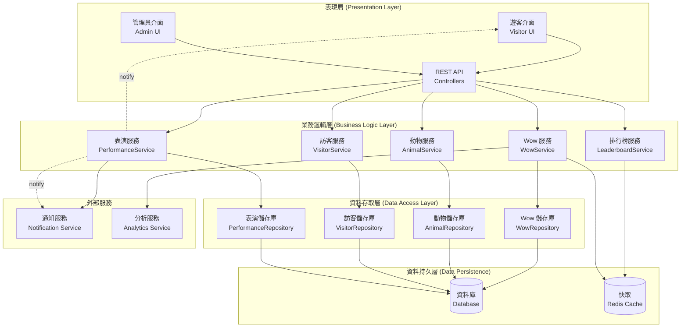
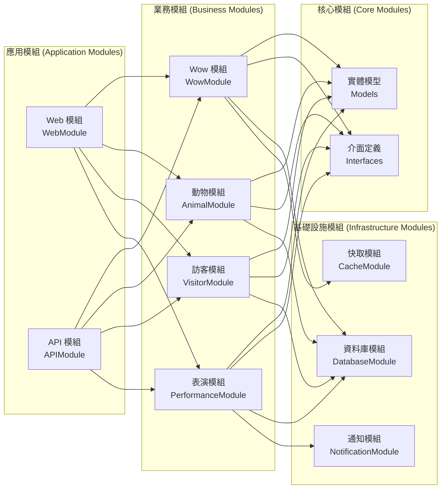

# 系統架構設計

## UML 系統架構圖



## 模組依賴圖



## 整體架構概述

本系統採用分層架構（Layered Architecture）設計，結合 MVC（Model-View-Controller）模式，確保系統的可維護性和擴展性。

## 架構層級

### 1. 表現層（Presentation Layer）

負責使用者介面和使用者互動。

**組件：**
- **VisitorUI：** 遊客介面
- **AdminUI：** 管理員介面
- **ViewControllers：** 介面控制器

**職責：**
- 顯示系統資訊
- 接收使用者輸入
- 呈現操作結果
- 處理介面互動邏輯

### 2. 業務邏輯層（Business Logic Layer）

處理核心業務邏輯和規則。

**組件：**
- **WowService：** Wow 相關業務邏輯
- **AnimalService：** 動物管理業務邏輯
- **VisitorService：** 遊客服務業務邏輯
- **PerformanceService：** 表演管理業務邏輯
- **LeaderboardService：** 排行榜業務邏輯

**職責：**
- 實作業務規則
- 協調各個領域物件
- 處理業務流程
- 驗證業務約束

### 3. 資料存取層（Data Access Layer）

負責資料的儲存和檢索。

**組件：**
- **Repository Pattern：** 資料存取抽象
- **DataContext：** 資料庫上下文
- **EntityRepositories：** 實體資料存取

**職責：**
- 資料持久化
- 資料查詢和檢索
- 資料庫連接管理
- 資料完整性維護

## 核心模組設計

### 1. Wow 管理模組

```
WowModule {
    - WowService
    - WowRepository
    - WowValidator
    - WowStatisticsCalculator
}
```

**功能：**
- Wow 記錄建立和管理
- Wow 統計計算
- Wow 分享功能
- Wow 驗證規則

### 2. 動物管理模組

```
AnimalModule {
    - AnimalService
    - AnimalRepository
    - SkillService
    - PerformanceScheduler
}
```

**功能：**
- 動物資訊管理
- 技能管理
- 表演排程
- 隨機表演觸發

### 3. 遊客服務模組

```
VisitorModule {
    - VisitorService
    - VisitorRepository
    - WowCollectionService
    - AuthenticationService
}
```

**功能：**
- 遊客註冊和管理
- Wow 收集記錄
- 簡易身份驗證
- 個人化服務

### 4. 排行榜模組

```
LeaderboardModule {
    - LeaderboardService
    - RankingCalculator
    - StatisticsAggregator
}
```

**功能：**
- 排行榜計算
- 統計資料聚合
- 即時排名更新
- 歷史資料追蹤

## 設計模式應用

### 1. Repository Pattern（儲存庫模式）

```typescript
interface IWowRepository {
    create(wow: Wow): Promise<Wow>;
    findById(id: string): Promise<Wow | null>;
    findByVisitor(visitorId: string): Promise<Wow[]>;
    findByAnimal(animalId: string): Promise<Wow[]>;
    update(wow: Wow): Promise<Wow>;
    delete(id: string): Promise<boolean>;
}
```

**優點：**
- 分離業務邏輯與資料存取
- 易於單元測試
- 支援不同資料來源

### 2. Observer Pattern（觀察者模式）

```typescript
interface PerformanceObserver {
    onPerformanceStarted(performance: Performance): void;
    onPerformanceEnded(performance: Performance): void;
}

class PerformanceNotifier {
    private observers: PerformanceObserver[] = [];
    
    public addObserver(observer: PerformanceObserver): void;
    public removeObserver(observer: PerformanceObserver): void;
    public notifyPerformanceStarted(performance: Performance): void;
    public notifyPerformanceEnded(performance: Performance): void;
}
```

**應用場景：**
- 表演開始時通知所有遊客
- Wow 評分時更新排行榜
- 系統狀態變化通知

### 3. Strategy Pattern（策略模式）

```typescript
interface WowScoringStrategy {
    calculateScore(wow: Wow): number;
}

class CategoryBasedScoring implements WowScoringStrategy {
    public calculateScore(wow: Wow): number {
        // 實作基於類型的計分邏輯
    }
}

class IntensityBasedScoring implements WowScoringStrategy {
    public calculateScore(wow: Wow): number {
        // 實作基於強度的計分邏輯
    }
}
```

**應用場景：**
- 不同的 Wow 計分策略
- 多種排行榜排序算法
- 表演選擇策略

### 4. Factory Pattern（工廠模式）

```typescript
interface WowFactory {
    createWow(type: WowCategory, data: WowData): Wow;
}

class ConcreteWowFactory implements WowFactory {
    public createWow(type: WowCategory, data: WowData): Wow {
        // 根據類型建立不同的 Wow 記錄
    }
}
```

**應用場景：**
- 建立不同類型的 Wow 記錄
- 生成不同類型的表演
- 建立各種統計報表

## 資料流架構

### 1. Wow 建立流程

```
Visitor Input → UI Controller → WowService → WowValidator 
→ WowRepository → Database → WowStatistics → LeaderboardService
```

### 2. 表演觸發流程

```
PerformanceScheduler → AnimalService → PerformanceService 
→ PerformanceNotifier → UI Controllers → Visitor UIs
```

### 3. 排行榜更新流程

```
Wow Creation → WowService → LeaderboardService → RankingCalculator 
→ StatisticsAggregator → LeaderboardRepository → Cache Update
```

## 非功能性架構考量

### 1. 效能優化

**快取策略：**
- 排行榜資料快取
- 動物資訊快取
- 統計資料快取

**資料庫優化：**
- 索引優化
- 查詢最佳化
- 連接池管理

### 2. 可擴展性

**水平擴展：**
- 微服務架構準備
- 資料庫分片支援
- 負載平衡準備

**垂直擴展：**
- 模組化設計
- 鬆散耦合
- 介面抽象

### 3. 可靠性

**錯誤處理：**
- 異常處理機制
- 錯誤日誌記錄
- 失敗回復機制

**資料一致性：**
- 交易管理
- 資料完整性約束
- 併發控制

### 4. 安全性

**輸入驗證：**
- 參數驗證
- SQL 注入防護
- XSS 防護

**存取控制：**
- 使用者權限管理
- API 存取限制
- 資料存取控制

## 部署架構

### 開發環境
- 單機部署
- 記憶體資料庫
- 檔案系統儲存

### 生產環境
- 容器化部署
- 關聯式資料庫
- Redis 快取
- 負載平衡器

## 技術堆疊建議

### 後端
- **程式語言：** TypeScript / Node.js
- **框架：** Express.js / NestJS / Fastify
- **資料庫：** PostgreSQL / MongoDB
- **快取：** Redis
- **訊息佇列：** RabbitMQ / Apache Kafka

### 前端
- **框架：** React / Vue.js / Angular
- **狀態管理：** Redux / Vuex / NgRx
- **UI 框架：** Material-UI / Ant Design / Bootstrap

### DevOps
- **容器化：** Docker
- **協調器：** Kubernetes
- **CI/CD：** Jenkins / GitLab CI / GitHub Actions
- **監控：** Prometheus / Grafana
