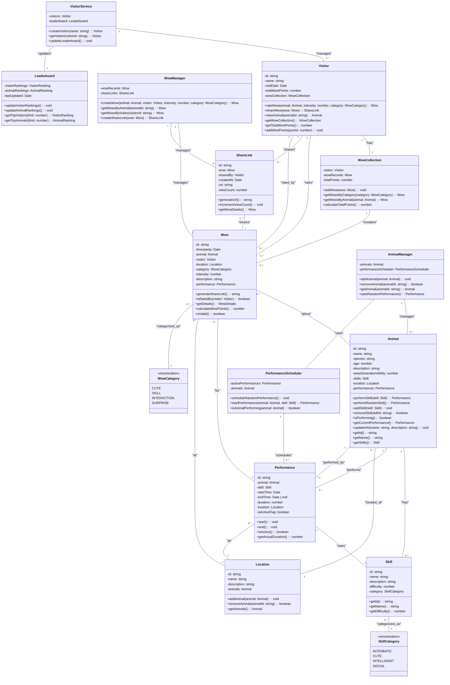

# 類別圖設計

## UML 類別圖



## 核心實體類別

### 1. Animal（動物）

```typescript
class Animal {
    private id: string;
    private name: string;
    private species: string;
    private age: number;
    private description: string;
    private wowGenerationAbility: number; // 1-10
    private skills: Skill[];
    private location: Location;
    
    public performSkill(skill: Skill): Performance;
    public generateWow(): void;
    public addSkill(skill: Skill): void;
    public removeSkill(skillId: string): boolean;
    public getSkills(): Skill[];
    public updateInfo(name: string, description: string): void;
}
```

### 2. Visitor（遊客）

```typescript
class Visitor {
    private id: string;
    private name: string;
    private visitDate: Date;
    private totalWowPoints: number;
    private wowCollection: WowCollection;
    
    public rateWow(animal: Animal, intensity: number, category: WowCategory): Wow;
    public shareWow(wow: Wow): ShareLink;
    public viewAnimal(animalId: string): Animal;
    public getWowCollection(): WowCollection;
    public getTotalWowPoints(): number;
}
```

### 3. Wow（驚嘆記錄）

```typescript
class Wow {
    private id: string;
    private timestamp: Date;
    private animal: Animal;
    private visitor: Visitor;
    private location: Location;
    private category: WowCategory;
    private intensity: number; // 1-10
    private description: string;
    private performance: Performance;
    
    public getId(): string;
    public getDetails(): WowDetails;
    public generateShareLink(): string;
    public isRatedBy(visitor: Visitor): boolean;
}
```

### 4. WowCategory（Wow分類）

```typescript
enum WowCategory {
    CUTE = "可愛類",        // 可愛類
    SKILL = "技能類",       // 技能類
    INTERACTION = "互動類", // 互動類
    SURPRISE = "驚喜類"     // 驚喜類
}
```

### 5. Skill（技能）

```typescript
class Skill {
    private id: string;
    private name: string;
    private description: string;
    private difficulty: number; // 1-10
    private category: SkillCategory;
    
    public perform(): Performance;
    public getDetails(): SkillDetails;
}
```

### 6. Performance（表演）

```typescript
class Performance {
    private id: string;
    private animal: Animal;
    private skill: Skill;
    private startTime: Date;
    private duration: number;
    private location: Location;
    private isActive: boolean;
    private wowRecords: Wow[];
    
    public start(): void;
    public end(): void;
    public addWowRecord(wow: Wow): void;
    public canBeRatedBy(visitor: Visitor): boolean;
}
```

### 7. Location（地點）

```typescript
class Location {
    private id: string;
    private name: string;
    private description: string;
    private animals: Animal[];
    
    public addAnimal(animal: Animal): void;
    public removeAnimal(animalId: string): boolean;
    public getAnimals(): Animal[];
}
```

## 集合和管理類別

### 8. WowCollection（Wow收集記錄）

```typescript
class WowCollection {
    private visitor: Visitor;
    private wowRecords: Wow[];
    private totalPoints: number;
    
    public addWow(wow: Wow): void;
    public getWowsByCategory(category: WowCategory): Wow[];
    public getWowsByAnimal(animal: Animal): Wow[];
    public calculateTotalPoints(): number;
    public getStatistics(): CollectionStats;
}
```

### 9. ShareLink（分享連結）

```typescript
class ShareLink {
    private id: string;
    private wow: Wow;
    private sharedBy: Visitor;
    private createdAt: Date;
    private url: string;
    private viewCount: number;
    
    public generateUrl(): string;
    public incrementViewCount(): void;
    public getWowDetails(): Wow;
}
```

## 服務和管理類別

### 10. WowManager（Wow管理器）

```typescript
class WowManager {
    private wowRecords: Wow[];
    private shareLinks: ShareLink[];
    
    public createWow(animal: Animal, visitor: Visitor, intensity: number, category: WowCategory): Wow;
    public getWowsByAnimal(animalId: string): Wow[];
    public getWowsByVisitor(visitorId: string): Wow[];
    public generateStatistics(): WowStatistics;
    public createShareLink(wow: Wow): ShareLink;
    public getSharedWow(linkId: string): Wow;
}
```

### 11. AnimalManager（動物管理器）

```typescript
class AnimalManager {
    private animals: Animal[];
    private performanceScheduler: PerformanceScheduler;
    
    public addAnimal(animal: Animal): void;
    public removeAnimal(animalId: string): boolean;
    public updateAnimal(animal: Animal): void;
    public getAnimal(animalId: string): Animal | null;
    public getAllAnimals(): Animal[];
    public startRandomPerformance(): Performance;
}
```

### 12. VisitorService（訪客服務）

```typescript
class VisitorService {
    private visitors: Visitor[];
    private leaderboard: Leaderboard;
    
    public createVisitor(name: string): Visitor;
    public getVisitor(visitorId: string): Visitor | null;
    public updateLeaderboard(): void;
    public getVisitorRanking(visitor: Visitor): number;
}
```

### 13. Leaderboard（排行榜）

```typescript
class Leaderboard {
    private visitorRankings: VisitorRanking[];
    private animalRankings: AnimalRanking[];
    private lastUpdated: Date;
    
    public updateVisitorRankings(): void;
    public updateAnimalRankings(): void;
    public getTopVisitors(limit: number): VisitorRanking[];
    public getTopAnimals(limit: number): AnimalRanking[];
    public getVisitorRank(visitor: Visitor): number;
    public getAnimalRank(animal: Animal): number;
}
```

### 14. PerformanceScheduler（表演排程器）

```typescript
class PerformanceScheduler {
    private activePerformances: Performance[];
    private animals: Animal[];
    
    public scheduleRandomPerformance(): void;
    public startPerformance(animal: Animal, skill: Skill): Performance;
    public endPerformance(performanceId: string): void;
    public getActivePerformances(): Performance[];
    public isAnimalPerforming(animal: Animal): boolean;
}
```

## 類別關係

### 繼承關係
- 無明顯繼承需求

### 組合關係
- Visitor 組合 WowCollection
- Animal 組合 Skill[]
- Performance 組合 Animal, Skill, Location
- WowManager 組合 Wow[], ShareLink[]

### 聚合關係
- Location 聚合 Animal[]
- Leaderboard 聚合 VisitorRanking[], AnimalRanking[]

### 關聯關係
- Wow 關聯 Animal, Visitor, Performance
- ShareLink 關聯 Wow, Visitor
- Performance 關聯 Animal, Skill, Location

## 關鍵設計原則

1. **單一職責原則：** 每個類別都有明確的職責
2. **開放封閉原則：** 易於擴展新的 Wow 類型和技能
3. **依賴倒置原則：** 高層模組不依賴低層模組的具體實現
4. **介面隔離原則：** 小而專精的介面設計
