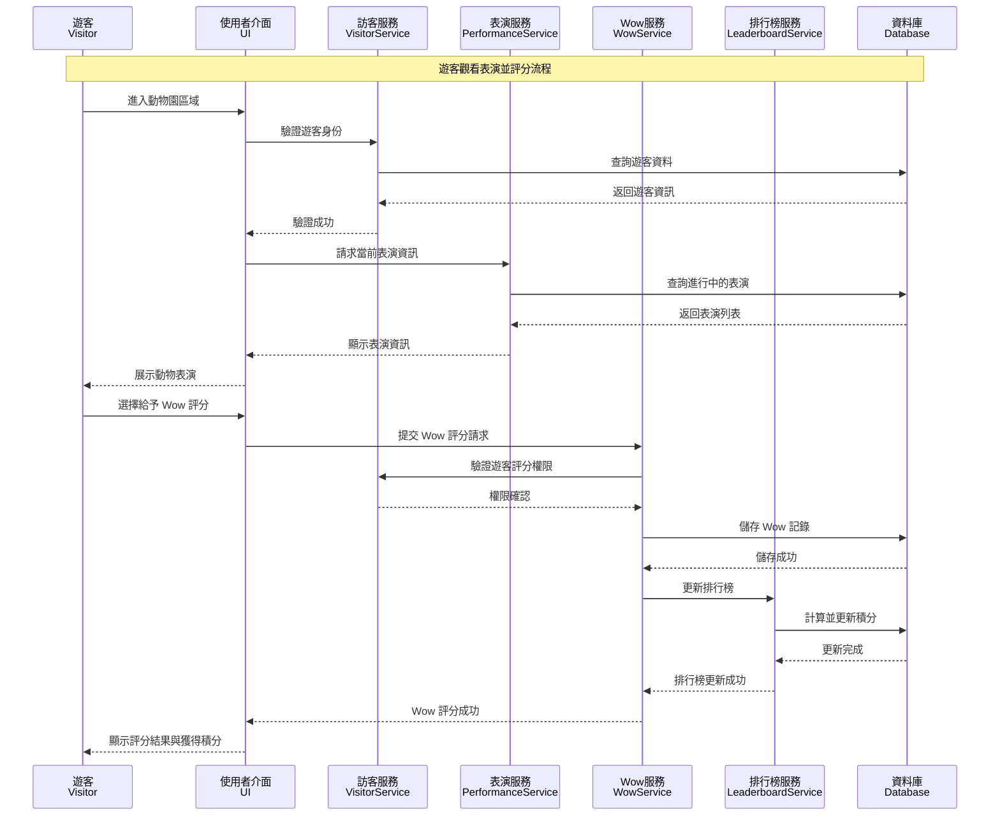
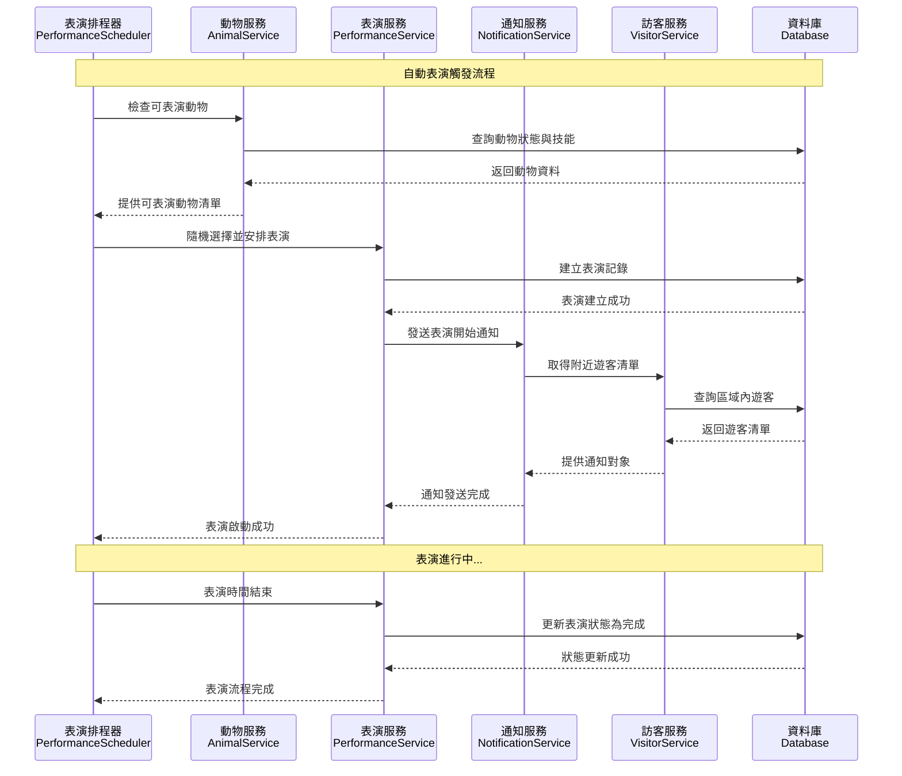
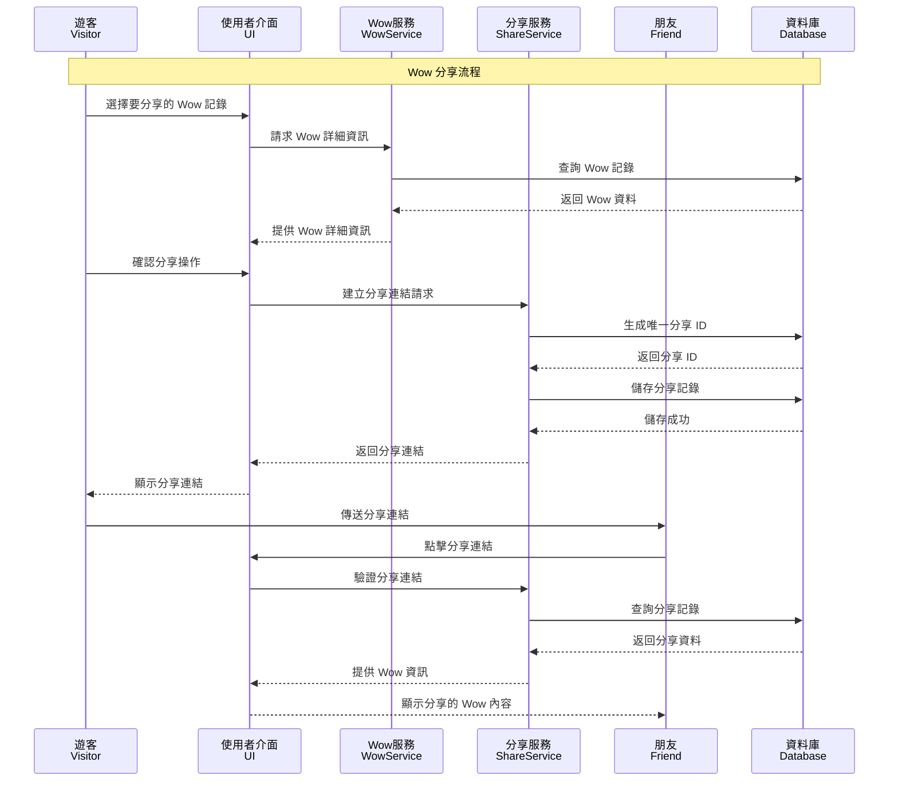
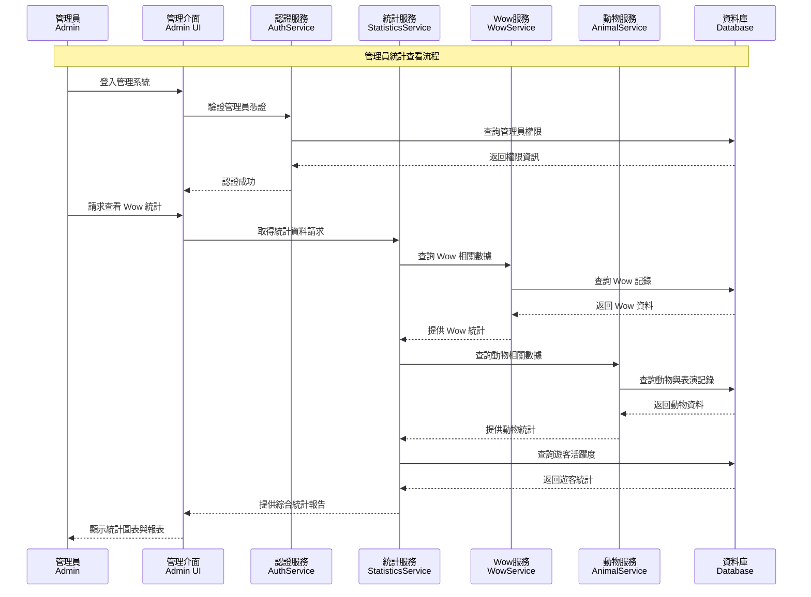
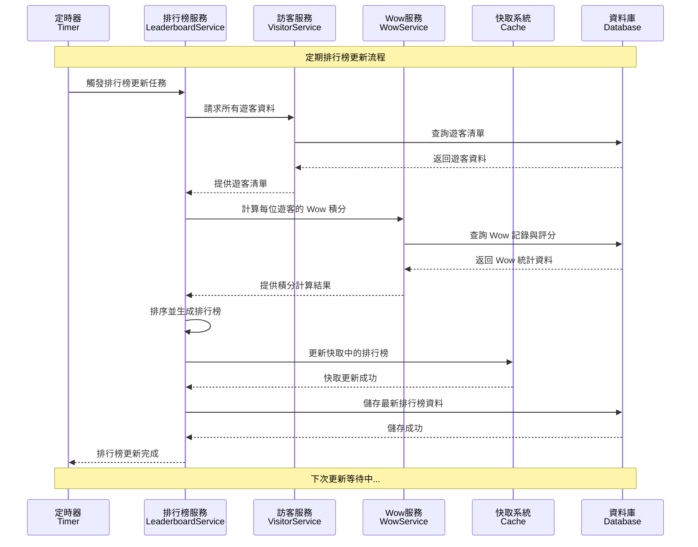

# 循序圖文件

本文件包含動物園 Wow 收集系統的主要互動流程循序圖，展示不同使用案例中各個物件之間的時序互動關係。

## 1. 遊客評分 Wow 流程

展示遊客觀看動物表演並給予 Wow 評分的完整流程。

## 2. 動物自動表演觸發流程

展示系統自動觸發動物表演的內部流程。

## 3. Wow 分享流程

展示遊客分享 Wow 記錄給朋友的流程。

## 4. 管理員查看統計流程

展示管理員查看系統統計資料的流程。

## 5. 排行榜更新流程

展示系統自動更新排行榜的流程。

## 循序圖設計原則

### 1. 時序性 (Temporal Ordering)

- 每個循序圖都按照實際的時間順序展示互動
- 使用同步訊息 (`->>`) 表示需要等待回應的呼叫
- 使用非同步訊息 (`-->>`) 表示回應訊息

### 2. 職責分離 (Separation of Concerns)

- 每個參與者都有明確的職責範圍
- 業務邏輯與資料存取分離
- UI 層與服務層分離

### 3. 錯誤處理

雖然圖中為了簡潔沒有完全展示，但實際實作中每個服務調用都應包含：

- 異常處理機制
- 失敗回滾策略
- 使用者友善的錯誤訊息

### 4. 效能考量

- 使用快取減少資料庫存取
- 批次處理大量資料操作
- 非同步處理不需要即時回應的操作

## 與其他設計文件的關聯

- **類別圖**: 循序圖中的參與者對應類別圖中的類別
- **使用案例圖**: 每個循序圖實現一個或多個使用案例
- **系統架構**: 參與者的分層對應系統架構的層次設計

這些循序圖提供了系統動態行為的詳細視圖，有助於開發團隊理解系統的運作流程並進行實作。
